# SafeWeb AI — 13 Professional-Grade UML Diagrams
> Final Production Deployment on Microsoft Azure

---

## Diagram 1: Functional Requirements

```mermaid
---
title: SafeWeb AI — Functional Requirements
---
mindmap
  root((SafeWeb AI\nFunctional\nRequirements))
    User Management
      Registration
        Email and Password signup
        Google OAuth2 ID-token login
        Input validation and uniqueness check
      Authentication
        JWT login with access + refresh tokens
        Remember Me extending refresh to 30 days
        Token rotation and blacklist on logout
        Password reset via email token
      Two-Factor Authentication
        TOTP secret generation
        QR code provisioning
        6-digit OTP verification
        Backup codes generation
      Profile Management
        Update avatar, company, job title
        Change password with old verification
        View active sessions with IP and user-agent
        Revoke specific sessions
      API Key Management
        Generate sk_live_ prefixed keys
        List and revoke API keys
        Track scans count per key
      Session Tracking
        Record IP address and user agent
        Mark session inactive on logout
        List last 10 sessions

    Scanning Engine
      Scan Creation
        Website target with URL validation
        Depth selection shallow medium deep
        Scope type single-domain wildcard wide-scope
        Include subdomains toggle
        SSL check and follow-redirects options
        Authenticated scanning form API cookie bearer
      Wide Scope Handling
        DNS-based domain discovery
        User confirmation of discovered domains
        Create child scans per confirmed domain
      Scan Lifecycle
        Real-time SSE progress streaming
        Phase change and finding events
        Scan status tracking pending scanning completed failed
        Error capture and storage
      Pipeline Execution
        Phase 0 Pre Tool health check and OOB setup
        Phase 0a Parallel recon DNS WHOIS certs WAF subdomains ports
        Phase 0b Response recon tech fingerprint headers cookies CORS JS
        Phase 0c Cross-module email enum secrets cloud OSINT
        Phase 0d Analytics vuln correlator attack surface risk scoring
        Phase 0.5 Auth setup form OAuth OIDC SAML headless JWT
        Phase 1 BFS crawling Playwright SPA rendering
        Phase 1.1 Form interaction CAPTCHA detection deep only
        Phase 1.5 Attack surface model and Ollama LLM attack strategy
        Phase 2-4 Parallel analyzers headers SSL cookies
        Phase 5 ML-prioritized 85+ vulnerability testers
        Phase 5.1 OOB callback polling Interactsh
        Phase 5b Nuclei template engine CLI and Python
        Phase 5c Secret scanning 200+ regex and entropy
        Phase 5d Integrated scanners sqlmap dalfox nikto testssl
        Phase 5.5 Evidence verification replay differential ML
        Phase 5.7 Exploit generation and bug bounty report drafting
        Phase 6 Attack graph MITRE ATT-and-CK mapping
        Phase 6.1 Vulnerability chaining 10+ multi-step patterns
        Phase 6.5 False positive reduction 5-component ensemble
        Phase 7 ScanMemory and knowledge updater
        Final Score calculation and cleanup
      Scan Operations
        Rescan target with new scan clone
        Delete scan with cascade
        Compare two scans new fixed regressed findings
        Multi-target batch scanning
        Scheduled recurring scans

    Vulnerability Management
      Automated Testing
        85+ vulnerability testers
        33 vulnerability categories
        5 severity levels critical high medium low info
        CWE identifier mapping
        CVSS score 0.0 to 10.0
      Evidence and Verification
        Evidence collection per finding
        Replay verification of findings
        Differential analysis
        ML-based false positive classification
      False Positive Reduction
        5-component ensemble scorer
        Classifier 35pct weight
        Anomaly detector 20pct
        Heuristic rules 15pct
        Historical patterns 10pct
        LLM reasoning 20pct
      Exploit Generation
        Proof-of-concept code generation
        Bug bounty report drafting
        Attack chain detection and linking
      Management
        Mark vulnerability as false positive
        Re-verify individual finding
        Filter by severity category verified status

    AI Chatbot
      Natural Language Interface
        Context-aware conversation
        Scan data injection into context
        Last 10 messages conversation history
        User profile plan and stats context
      Function Calling Tools
        start_scan target type depth
        get_recent_scans with limit
        get_scan_status by scan ID
        export_scan in selected format
        get_subscription_info user plan details
        get_vulnerability_details by vuln ID
        navigate_to page routing command
      Fallback System
        36+ keyword-matched local knowledge base
        Topic matching on LLM failure
      Feedback
        Thumbs up positive feedback
        Thumbs down negative feedback

    Reporting and Export
      Export Formats
        JSON structured data
        CSV spreadsheet compatible
        PDF executive report with charts
        SARIF 2.1.0 security tooling integration
        HTML interactive report
      Report Content
        Executive summary
        Vulnerability breakdown by severity
        CVSS and CWE references
        Remediation recommendations
        Evidence and proof-of-concept sections

    Scheduling and Monitoring
      Scheduled Scans
        Preset intervals hourly daily weekly monthly
        Custom cron expression
        Activate and deactivate schedules
        Auto-create scan on schedule trigger
      Asset Change Monitoring
        11 change types new subdomain removed subdomain
        SSL expiring SSL expired new port closed port
        Tech added tech removed new finding fixed finding regressed finding
        Acknowledge change records
      Webhook Notifications
        4 event types scan_started finding_detected scan_completed scan_failed
        Configurable retry up to max_retries
        HMAC-signed payloads with secret
        Delivery history tracking with HTTP status
        Test webhook endpoint

    Scope and Asset Management
      Scope Definitions
        Manual in-scope and out-of-scope URL lists
        Import from HackerOne program scope
        Import from Bugcrowd program scope
        Import from plain text file
        Validate URL against active scope
      Asset Inventory
        7 asset types web_app API mobile_api CDN subdomain IP other
        Technology stack tracking per asset
        First-seen and last-seen timestamps
        New asset flagging
        Organization grouping

    Nuclei Templates
      Template Management
        Upload custom YAML templates
        Activate and deactivate templates
        Categorize by severity and category
        List builtin plus custom templates
      Community Sync
        Clone ProjectDiscovery community templates
        Pull latest template updates
        Template indexing stats

    Admin Panel
      System Dashboard
        Total users scans vulnerabilities
        Active alerts overview
        Trend metrics
      User Management
        List users with search and filter
        Create new user account
        Edit role and subscription plan
        Delete user account
        Prevent self-demotion
      Scan Management
        View all scans across all users
        Cancel running scan
        Delete any scan
      ML Model Management
        View model metrics accuracy precision recall F1
        Trigger training for phishing malware anomaly models
        Activate specific model version
      System Settings
        Site name and maintenance mode toggle
        Max scans per user limit
        Registration open or closed toggle
        Rate limit configuration
      Contact Management
        View unread messages
        Reply to contact with admin attribution
        Mark as read
        Delete messages
      Job Application Management
        View applications with status filter
        Update status pending reviewed shortlisted rejected
        Add admin notes
      System Alerts
        Create informational warning error critical alerts
        Mark alert as resolved

    Learning Center
      Article Library
        9 categories injection XSS best-practices API-security
        Authentication security-headers access-control cryptography network-security
        Search by keyword
        Filter by category
        Public read-only access
      Article Content
        Rich text content with markdown
        Author and read-time metadata
        Publish and unpublish articles
```

---

## Diagram 2: Non-Functional Requirements

```mermaid
---
title: SafeWeb AI — Non-Functional Requirements
---
mindmap
  root((SafeWeb AI\nNon-Functional\nRequirements))
    Performance
      API Response Times
        P95 under 5 seconds
        P99 under 10 seconds
      Celery Broker
        Task dispatch latency under 100ms
      Frontend
        Initial JS bundle under 200KB
        Lazy-loaded page chunks under 50KB
        Lighthouse score target 90+
      Database
        PgBouncer connection pool 20 connections transaction mode
        Query plan optimization with indexes
      Scanning
        AsyncTaskRunner max concurrency 25 testers
        SSE push interval every 2 seconds
        Maximum scan duration 4 hours
        Debounced finding saves to reduce DB writes

    Scalability
      Compute
        Azure App Service auto-scale 1 to 4 instances
        CPU threshold trigger at 70 percent
        Celery workers on Azure Container Instances
      Storage
        PostgreSQL auto-grow 32GB to 1TB
        Blob Storage GRS hot tier unlimited
        Redis Standard C1 1GB with TLS
      Future
        PostgreSQL read replicas for analytics
        Horizontal Celery worker scaling
        CDN edge caching for static assets globally

    Security
      Authentication
        JWT access tokens 60-minute expiry
        Refresh tokens 7-day default 30-day with remember_me
        Token rotation on every refresh
        Token blacklist on logout via Redis
        TOTP two-factor authentication
      Transport
        TLS enforced everywhere including Redis port 6380
        HSTS headers via CDN
        SSL certificate auto-renewal via Azure
      Access Control
        CORS whitelist to known origins only
        CSRF protection on state-changing endpoints
        Rate limiting 30 requests per minute anonymous
        Rate limiting 120 requests per minute authenticated
        Admin role check on all admin endpoints
      Secrets Management
        Azure Key Vault with Managed Identity access
        No credentials in code or environment files
        Secret rotation every 90 days
        Django SECRET_KEY in Key Vault
      Network
        VNet private endpoints for PostgreSQL and Redis
        Azure Front Door WAF OWASP 3.2 ruleset
        DDoS standard protection on Front Door
        Geo-filtering capability
      Input Validation
        Request schema validation on all endpoints
        File upload type and size checks
        Target URL validation and scope enforcement

    Reliability
      High Availability
        Zone-redundant PostgreSQL Flexible Server
        App Service multi-instance deployment
        Redis Standard C1 with replication
      Backup and Recovery
        Automated daily PostgreSQL backups
        35-day backup retention
        RPO target 1 hour
        RTO target 15 minutes
      Deployment
        Blue-green slot swap zero-downtime deployments
        Smoke tests before slot promotion
        Automated rollback on test failure
      Resilience
        Graceful degradation when external tools unavailable
        Retry logic for external tool invocations
        PgBouncer for database connection resilience
        Celery task retry with exponential backoff
        SSE reconnect on connection drop

    Maintainability
      Code Architecture
        Modular scanning engine each tester independent
        6 Django apps with clean boundaries
        Registry pattern for tool discovery and health
        Strategy pattern for scan depth behaviors
        Template method pattern for tester lifecycle
        Observer pattern for SSE event emission
      Frontend
        TypeScript strict typing on all components
        Lazy loading with React Suspense and ErrorBoundary
        Axios interceptor abstraction for token refresh
      Infrastructure
        Bicep IaC templates for all Azure resources
        GitHub Actions CI-CD pipeline
        pip-audit and tsc checks on every push

    Observability
      Application Performance
        Azure Application Insights APM
        Request tracing with correlation IDs
        Dependency call tracking external APIs and DB
        Exception logging with stack traces
      Logging
        Log Analytics workspace with KQL queries
        Structured JSON logs from Django
        Celery task execution logs
      Scan Telemetry
        Per-phase timing stored in phase_timings JSONB
        data_version counter for SSE consistency
        tester_results array with duration and status
      Alerting
        Alert on 5xx error rate above 5 percent
        Alert on P95 response above 5 seconds
        Alert on Celery queue depth above 50
        Alert on PostgreSQL connection failures

    Usability
      Interface
        Responsive dark cybersecurity-themed UI
        TailwindCSS utility classes
        Real-time scan progress with phase labels
        ETA estimation from phase timings
      Accessibility
        Error boundaries preventing full-page crashes
        Loading skeletons during data fetches
        Toast notifications for async actions
      AI Assistance
        Floating chatbot widget on all pages
        Context-aware suggestions based on current scan
        Markdown-rendered AI responses

    Compliance
      Security Standards
        OWASP WSTG full category coverage
        CWE identifier on every vulnerability
        CVSS score compliant with CVSS v3.1
        SARIF 2.1.0 export for CI-CD integration
        MITRE ATT-and-CK mapping on attack graphs
      Data and Privacy
        SOC 2 readiness with audit logging
        GDPR readiness with user data deletion
        Data residency in selected Azure region
      Bug Bounty Platform
        HackerOne scope import compatibility
        Bugcrowd scope import compatibility
        SARIF export for automated tooling
```

---

## Diagram 3A: DFD — Level 0 Context Diagram

```mermaid
---
title: SafeWeb AI — DFD Level 0 Context Diagram
---
flowchart TD
    U["👤 Authenticated User"]
    ANON["👤 Anonymous Visitor"]
    ADMIN["👤 Admin"]
    GOOG["🔑 Google OAuth Provider"]
    OAI["🤖 OpenRouter LLM\nGemini 2.0 Flash"]
    OLLAMA["🤖 Ollama Local LLM\nllama3.1:8b"]
    INTER["📡 Interactsh OOB Server"]
    TOOLS["🔧 62 External Security Tools\nnmap nuclei sqlmap subfinder..."]
    TARGET["🌐 Target Web Application"]
    EMAIL["✉️ Azure Communication Services\nEmail"]
    SYS(("⚙️\nSafeWeb AI\nSystem"))

    U -->|"Register login profile scan\nrequest export chat"| SYS
    SYS -->|"JWT tokens scan results\nvulnerabilities reports SSE events"| U
    ANON -->|"Browse learn contact\napply for jobs"| SYS
    SYS -->|"Articles docs pages\nconfirmation messages"| ANON
    ADMIN -->|"Manage users scans\nML settings contacts"| SYS
    SYS -->|"Admin dashboard data\nusers scans analytics"| ADMIN
    GOOG -->|"User identity token\nOAuth2 ID token"| SYS
    SYS -->|"OAuth2 authorization request"| GOOG
    SYS -->|"Chat messages with\nfunction definitions"| OAI
    OAI -->|"AI responses tool\ncalls and results"| SYS
    SYS -->|"Scan context attack\nstrategy prompts"| OLLAMA
    OLLAMA -->|"Attack strategy\nand reasoning"| SYS
    SYS -->|"Register OOB payload\ncallback URLs"| INTER
    INTER -->|"Callback interactions\nDNS HTTP SMTP hits"| SYS
    SYS -->|"Scan commands with\ntarget parameters"| TOOLS
    TOOLS -->|"Tool output findings\nraw scan data"| SYS
    SYS -->|"HTTP requests\nfuzz payloads crawl"| TARGET
    TARGET -->|"HTTP responses\npage content headers"| SYS
    SYS -->|"Password reset emails\nnotification emails"| EMAIL

    style SYS fill:#1a1a2e,color:#00d4ff,stroke:#00d4ff,stroke-width:3px
    style U fill:#16213e,color:#fff,stroke:#0f3460
    style ANON fill:#16213e,color:#fff,stroke:#0f3460
    style ADMIN fill:#16213e,color:#fff,stroke:#ff6b6b
    style GOOG fill:#0f3460,color:#fff,stroke:#e94560
    style OAI fill:#0f3460,color:#fff,stroke:#e94560
    style OLLAMA fill:#0f3460,color:#fff,stroke:#e94560
    style INTER fill:#0f3460,color:#fff,stroke:#e94560
    style TOOLS fill:#0f3460,color:#fff,stroke:#e94560
    style TARGET fill:#533483,color:#fff,stroke:#e94560
    style EMAIL fill:#0f3460,color:#fff,stroke:#e94560
```

---

## Diagram 3B: DFD — Level 1

```mermaid
---
title: SafeWeb AI — DFD Level 1
---
flowchart TD
    subgraph EXT["External Entities"]
        U["👤 User"]
        ADMIN["👤 Admin"]
        ANON["👤 Visitor"]
        GOOG["Google OAuth"]
        LLM["OpenRouter LLM"]
        OLLAMA["Ollama LLM"]
        OOB["Interactsh"]
        EXTTOOLS["62 CLI Tools"]
        TARGET["Target App"]
        EMAILSVC["Email Service"]
    end

    subgraph STORES["Data Stores"]
        D1[("D1\nUsers DB")]
        D2[("D2\nScans DB")]
        D3[("D3\nVulnerabilities DB")]
        D4[("D4\nChat Sessions DB")]
        D5[("D5\nML Models DB")]
        D6[("D6\nArticles DB")]
        D7[("D7\nSystem Settings DB")]
        D8[("D8\nBlob Storage\nreports exports ml-models")]
        D9[("D9\nRedis Cache\nCelery broker sessions")]
    end

    subgraph PROCS["Processes"]
        P1["1.0\nAuthentication &\nUser Management"]
        P2["2.0\nScanning Engine\nOrchestrator"]
        P3["3.0\nAI Chatbot\nEngine"]
        P4["4.0\nDashboard &\nReporting"]
        P5["5.0\nAdmin Panel"]
        P6["6.0\nLearning Center"]
        P7["7.0\nScheduling &\nMonitoring"]
        P8["8.0\nML Processing\nPipeline"]
    end

    U -- "credentials / Google token" --> P1
    P1 -- "JWT tokens / user data" --> U
    P1 -- "OAuth request" --> GOOG
    GOOG -- "identity token" --> P1
    P1 -- "read/write user record" --> D1
    P1 -- "write session" --> D9
    P1 -- "send reset email" --> EMAILSVC

    U -- "scan request / config" --> P2
    P2 -- "scan results / SSE events" --> U
    P2 -- "read user data" --> D1
    P2 -- "write/read scan record" --> D2
    P2 -- "write vulnerabilities" --> D3
    P2 -- "broker scan tasks" --> D9
    P2 -- "tool invocations" --> EXTTOOLS
    EXTTOOLS -- "findings raw output" --> P2
    P2 -- "HTTP traffic" --> TARGET
    TARGET -- "responses" --> P2
    P2 -- "OOB setup" --> OOB
    OOB -- "callback hits" --> P2
    P2 -- "attack strategy prompts" --> OLLAMA
    OLLAMA -- "strategy response" --> P2
    P2 -- "store reports" --> D8

    U -- "chat messages / scan context" --> P3
    P3 -- "AI response / actions" --> U
    P3 -- "read/write chat sessions" --> D4
    P3 -- "LLM API call" --> LLM
    LLM -- "response / tool call" --> P3
    P3 -- "read scan context" --> D2
    P3 -- "read user profile" --> D1
    P3 -- "trigger scan" --> P2

    U -- "request dashboard" --> P4
    P4 -- "stats / trend data / exports" --> U
    P4 -- "read scan data" --> D2
    P4 -- "read vulnerability data" --> D3
    P4 -- "read/write reports" --> D8

    ADMIN -- "admin operations" --> P5
    P5 -- "admin dashboard / results" --> ADMIN
    P5 -- "read/write users" --> D1
    P5 -- "read/write scans" --> D2
    P5 -- "read/write settings" --> D7
    P5 -- "trigger ML training" --> P8

    ANON -- "browse articles" --> P6
    P6 -- "article content" --> ANON
    P6 -- "read articles" --> D6

    P7 -- "schedule triggers" --> D9
    P7 -- "spawn scheduled scans" --> P2
    P7 -- "write asset monitor records" --> D2
    P7 -- "send webhook notifications" --> U
    P7 -- "read scheduled scan configs" --> D2

    P8 -- "read/write ML models" --> D5
    P8 -- "read/write ML models to storage" --> D8
    P8 -- "predictions to scan pipeline" --> P2
    P2 -- "feature data for prediction" --> P8

    style P2 fill:#1a1a2e,color:#00d4ff,stroke:#00d4ff
    style P1 fill:#16213e,color:#fff,stroke:#0f3460
    style P3 fill:#16213e,color:#fff,stroke:#0f3460
    style P4 fill:#16213e,color:#fff,stroke:#0f3460
    style P5 fill:#16213e,color:#ff6b6b,stroke:#ff6b6b
    style P6 fill:#16213e,color:#fff,stroke:#0f3460
    style P7 fill:#16213e,color:#fff,stroke:#0f3460
    style P8 fill:#16213e,color:#fff,stroke:#0f3460
```

---

## Diagram 3C: DFD — Level 2 (Scanning Engine)

```mermaid
---
title: SafeWeb AI — DFD Level 2: Scanning Engine
---
flowchart TD
    SCAN_IN(["Scan Request\n+ Config"])
    SCAN_DB[("Scans DB")]
    VULN_DB[("Vulnerabilities DB")]
    REDIS[("Redis\nBroker")]
    BLOB[("Blob Storage")]
    TOOLS(["62 External Tools"])
    TARGET(["Target Application"])
    OOB(["Interactsh OOB"])
    OLLAMA(["Ollama LLM"])
    ML(["ML Pipeline"])
    SSE_OUT(["SSE Stream\nto Browser"])

    P21["2.1\nScan Creation\n& Validation"]
    P22["2.2\nReconnaissance\n4 Waves Parallel"]
    P23["2.3\nCrawling &\nForm Interaction"]
    P24["2.4\nAttack Surface\nModeling"]
    P25["2.5\nVulnerability Testing\n85+ Testers"]
    P26["2.6\nNuclei Template\nEngine"]
    P27["2.7\nSecret Scanning\n200+ Patterns"]
    P28["2.8\nEvidence\nVerification"]
    P29["2.9\nExploit\nGeneration"]
    P210["2.10\nCorrelation &\nVuln Chaining"]
    P211["2.11\nFalse Positive\nReduction"]
    P212["2.12\nScore\nCalculation"]

    SCAN_IN --> P21
    P21 -- "create scan record" --> SCAN_DB
    P21 -- "dispatch task" --> REDIS
    REDIS -- "task pickup" --> P22

    P22 -- "DNS WHOIS WAF subdomains" --> TOOLS
    TOOLS -- "recon results" --> P22
    P22 -- "recon_data JSONB" --> SCAN_DB
    P22 -- "phase progress SSE" --> SSE_OUT
    P22 -- "discovered URLs + domains" --> P23

    P23 -- "HTTP crawl requests" --> TARGET
    TARGET -- "page responses" --> P23
    P23 -- "crawled pages forms endpoints" --> P24
    P23 -- "progress SSE" --> SSE_OUT

    P24 -- "attack strategy prompt" --> OLLAMA
    OLLAMA -- "prioritized attack plan" --> P24
    P24 -- "prioritized entry points" --> P25
    P24 -- "attack surface model" --> SCAN_DB

    P25 -- "test payloads" --> TARGET
    TARGET -- "test responses" --> P25
    P25 -- "ML priority score request" --> ML
    ML -- "prioritized tester order" --> P25
    P25 -- "raw findings" --> P28
    P25 -- "finding SSE events" --> SSE_OUT
    P25 -- "OOB payloads" --> OOB
    OOB -- "callback correlation" --> P25

    P26 -- "nuclei templates from storage" --> BLOB
    P26 -- "nuclei CLI execution" --> TOOLS
    TOOLS -- "nuclei findings" --> P26
    P26 -- "template findings" --> P28

    P27 -- "regex entropy scan" --> TARGET
    P27 -- "git dumper via tools" --> TOOLS
    P27 -- "secret findings" --> P28

    P28 -- "replay requests to target" --> TARGET
    TARGET -- "replay responses" --> P28
    P28 -- "ML classifier request" --> ML
    ML -- "FP probability score" --> P28
    P28 -- "verified findings" --> P29

    P29 -- "PoC generation" --> OLLAMA
    OLLAMA -- "enhanced exploit" --> P29
    P29 -- "exploits + reports" --> P210

    P210 -- "chained vulnerabilities" --> P211
    P210 -- "attack graph data" --> SCAN_DB

    P211 -- "ensemble FP scoring" --> ML
    ML -- "FP scores" --> P211
    P211 -- "cleaned findings" --> P212
    P211 -- "write vulnerabilities" --> VULN_DB

    P212 -- "final score" --> SCAN_DB
    P212 -- "completion SSE" --> SSE_OUT
    P212 -- "generate report" --> BLOB

    style P25 fill:#1a1a2e,color:#00d4ff,stroke:#00d4ff
    style P22 fill:#16213e,color:#fff,stroke:#0f3460
```

---

## Diagram 4: Use Case Diagram

```mermaid
---
title: SafeWeb AI — Use Case Diagram
---
flowchart LR
    subgraph ACTORS_PUBLIC["Public Actors"]
        ANON["👤 Anonymous\nVisitor"]
        GOOG_ACT["🔑 Google OAuth\nProvider"]
        EMAIL_ACT["✉️ Email Service"]
    end

    subgraph ACTORS_AUTH["Authenticated Actors"]
        AUTH["👤 Authenticated\nUser"]
        PRO["👤 Pro User\nextends Authenticated"]
        ENT["👤 Enterprise User\nextends Pro"]
        ADMIN_ACT["👤 Admin\nextends Authenticated"]
    end

    subgraph ACTORS_SYS["System & External"]
        SYS_ACT["⚙️ System\nAutomated"]
        LLM_ACT["🤖 OpenRouter LLM"]
        OLLAMA_ACT["🤖 Ollama LLM"]
        TOOLS_ACT["🔧 External Tools\n62 CLI"]
        TARGET_ACT["🌐 Target\nApplication"]
    end

    subgraph UC_PUBLIC["Public Use Cases"]
        UC1(["View Home Page"])
        UC2(["Register Account"])
        UC3(["Login with Email"])
        UC4(["Google OAuth Login"])
        UC5(["Forgot Password"])
        UC6(["Reset Password"])
        UC7(["Browse Learning Center"])
        UC8(["Read Security Article"])
        UC9(["Submit Contact Form"])
        UC10(["Apply for Job"])
        UC11(["View Documentation"])
        UC12(["View Services Page"])
    end

    subgraph UC_AUTH["Authenticated Use Cases"]
        UC13(["View Dashboard"])
        UC14(["Create Website Scan"])
        UC15(["View Scan Results"])
        UC16(["View Scan History"])
        UC17(["Rescan Target"])
        UC18(["Delete Scan"])
        UC19(["Export Scan JSON/CSV"])
        UC20(["Compare Two Scans"])
        UC21(["View Real-time Progress SSE"])
        UC22(["Chat with AI Assistant"])
        UC23(["Provide Chat Feedback"])
        UC24(["Manage Profile"])
        UC25(["Enable/Disable 2FA"])
        UC26(["Change Password"])
        UC27(["View Active Sessions"])
        UC28(["Manage Scope Definitions"])
        UC29(["View Asset Inventory"])
        UC30(["Mark Finding as False Positive"])
        UC31(["View Tool Health Status"])
    end

    subgraph UC_PRO["Pro User Use Cases"]
        UC32(["Create Scheduled Scan"])
        UC33(["Manage API Keys"])
        UC34(["Configure Webhooks"])
        UC35(["Test Webhook Delivery"])
        UC36(["Export SARIF/HTML/PDF"])
        UC37(["Upload Nuclei Templates"])
        UC38(["Multi-Target Batch Scan"])
        UC39(["Import Scope HackerOne/Bugcrowd"])
        UC40(["Configure Authenticated Scanning"])
        UC41(["Deep Scan Depth"])
    end

    subgraph UC_ADMIN["Admin Use Cases"]
        UC42(["View Admin Dashboard"])
        UC43(["Manage Users CRUD"])
        UC44(["View All Scans"])
        UC45(["Cancel Running Scan"])
        UC46(["Train ML Models"])
        UC47(["Manage System Settings"])
        UC48(["Reply to Contacts"])
        UC49(["Manage Job Applications"])
        UC50(["View Chat Analytics"])
    end

    subgraph UC_SYS["System Use Cases"]
        UC51(["Execute Scheduled Scans"])
        UC52(["Deliver Webhooks with Retry"])
        UC53(["Monitor Asset Changes"])
        UC54(["Auto-scale Workers"])
        UC55(["Clean Expired Tokens"])
        UC56(["Validate Target URL"])
        UC57(["Dispatch Celery Task"])
        UC58(["LLM Function Calling"])
        UC59(["Generate PDF Report"])
        UC60(["Wide Scope Domain Resolution"])
    end

    ANON --> UC1
    ANON --> UC2
    ANON --> UC3
    ANON --> UC4
    ANON --> UC5
    ANON --> UC6
    ANON --> UC7
    ANON --> UC8
    ANON --> UC9
    ANON --> UC10
    ANON --> UC11
    ANON --> UC12

    AUTH --> UC13
    AUTH --> UC14
    AUTH --> UC15
    AUTH --> UC16
    AUTH --> UC17
    AUTH --> UC18
    AUTH --> UC19
    AUTH --> UC20
    AUTH --> UC21
    AUTH --> UC22
    AUTH --> UC23
    AUTH --> UC24
    AUTH --> UC25
    AUTH --> UC26
    AUTH --> UC27
    AUTH --> UC28
    AUTH --> UC29
    AUTH --> UC30
    AUTH --> UC31

    PRO --> UC32
    PRO --> UC33
    PRO --> UC34
    PRO --> UC35
    PRO --> UC36
    PRO --> UC37
    PRO --> UC38
    PRO --> UC39
    PRO --> UC40
    PRO --> UC41

    ADMIN_ACT --> UC42
    ADMIN_ACT --> UC43
    ADMIN_ACT --> UC44
    ADMIN_ACT --> UC45
    ADMIN_ACT --> UC46
    ADMIN_ACT --> UC47
    ADMIN_ACT --> UC48
    ADMIN_ACT --> UC49
    ADMIN_ACT --> UC50

    SYS_ACT --> UC51
    SYS_ACT --> UC52
    SYS_ACT --> UC53
    SYS_ACT --> UC54
    SYS_ACT --> UC55

    UC14 -.->|"<<include>>"| UC56
    UC14 -.->|"<<include>>"| UC57
    UC14 -.->|"<<extend>>"| UC60
    UC60 -.->|"<<extend>>"| UC14
    UC15 -.->|"<<include>>"| UC30
    UC22 -.->|"<<include>>"| UC58
    UC22 -.->|"<<extend>>"| UC14
    UC19 -.->|"<<extend>>"| UC59
    UC36 -.->|"<<extend>>"| UC59
    UC4 -.->|"<<include>>"| GOOG_ACT
    UC5 -.->|"<<include>>"| EMAIL_ACT
    UC58 -.->|"<<include>>"| LLM_ACT
    UC57 -.->|"triggers"| OLLAMA_ACT
    UC57 -.->|"invokes"| TOOLS_ACT
    TOOLS_ACT -.->|"scans"| TARGET_ACT
```

---

## Diagram 5A: Sequence — Authentication Flow

```mermaid
---
title: SafeWeb AI — Sequence 5A: Authentication Flow
---
sequenceDiagram
    participant BR as Browser
    participant RX as React App
    participant AX as Axios Interceptor
    participant API as Django Auth API
    participant DB as PostgreSQL
    participant RD as Redis Cache

    rect rgb(20, 30, 60)
        Note over BR,RD: REGISTRATION FLOW
        BR->>RX: Fill registration form (name, email, password)
        RX->>AX: POST /api/auth/register
        AX->>API: POST /api/auth/register {name, email, password}
        API->>API: Validate input, check email uniqueness
        API->>DB: INSERT INTO users (id, email, name, role=user, plan=free)
        DB-->>API: User record created
        API->>API: Generate JWT access (60min) + refresh (7d) tokens
        API-->>AX: 201 {user, access_token, refresh_token}
        AX-->>RX: Store tokens in memory/localStorage
        RX-->>BR: Redirect to /dashboard
    end

    rect rgb(20, 40, 30)
        Note over BR,RD: LOGIN FLOW
        BR->>RX: Fill login form (email, password, remember_me)
        RX->>AX: POST /api/auth/login
        AX->>API: POST /api/auth/login {email, password, remember_me}
        API->>DB: SELECT user WHERE email=? verify password hash
        DB-->>API: User record
        API->>DB: UPDATE users SET last_login=now(), last_login_ip=?
        API->>DB: INSERT INTO user_sessions (ip, user_agent, token_jti)
        DB-->>API: Session created
        API->>API: Generate JWT access(60min) + refresh(30d if remember_me)
        API->>RD: Store token_jti in active set
        RD-->>API: Stored
        API-->>AX: 200 {user, access_token, refresh_token, session_id}
        AX-->>RX: Store tokens
        RX-->>BR: Redirect to /dashboard
    end

    rect rgb(40, 20, 30)
        Note over BR,RD: TOKEN REFRESH FLOW
        BR->>RX: Trigger any authenticated action
        RX->>AX: API request with expired access token
        AX->>API: GET /api/protected (Authorization: Bearer expired_token)
        API-->>AX: 401 Unauthorized
        AX->>AX: Queue original request
        AX->>API: POST /api/auth/refresh {refresh_token}
        API->>RD: Check refresh token not blacklisted
        RD-->>API: Token valid
        API->>API: Generate new access token + rotate refresh token
        API->>RD: Blacklist old refresh token JTI
        API-->>AX: 200 {access_token, refresh_token}
        AX->>AX: Update stored tokens
        AX->>API: Replay all queued requests with new token
        API-->>AX: Successful responses
        AX-->>RX: Return results
        RX-->>BR: Display updated UI
    end

    rect rgb(40, 40, 20)
        Note over BR,RD: TWO-FACTOR AUTHENTICATION FLOW
        BR->>RX: Click Enable 2FA in profile settings
        RX->>AX: POST /api/user/profile/2fa/enable
        AX->>API: POST /api/user/profile/2fa/enable
        API->>API: Generate TOTP secret (base32)
        API->>API: Create otpauth:// URI and encode as QR
        API-->>AX: 200 {secret, qr_code_uri, backup_codes[]}
        AX-->>RX: Display QR code in UI
        RX-->>BR: Show QR code for authenticator app scan
        BR->>RX: Enter 6-digit TOTP code
        RX->>AX: POST /api/user/profile/2fa/verify {code}
        AX->>API: POST /api/user/profile/2fa/verify {code}
        API->>API: Validate TOTP code against stored secret
        API->>DB: UPDATE users SET is_2fa_enabled=true, two_fa_secret=?
        DB-->>API: Updated
        API-->>AX: 200 {message: 2FA enabled, backup_codes[]}
        AX-->>RX: Show success + backup codes
        RX-->>BR: Display backup codes to save
    end
```

---

## Diagram 5B: Sequence — Complete Scan Lifecycle

```mermaid
---
title: SafeWeb AI — Sequence 5B: Complete Scan Lifecycle
---
sequenceDiagram
    participant BR as Browser
    participant RX as React App
    participant SSE as useSSE Hook
    participant API as Django Scan API
    participant CEL as Celery Worker
    participant ORC as ScanOrchestrator
    participant RECON as Recon Modules
    participant CRAW as Web Crawler
    participant TEST as Vulnerability Testers
    participant NUCL as Nuclei Engine
    participant TOOL as External Tools
    participant DB as PostgreSQL
    participant RD as Redis
    participant OOB as Interactsh
    participant AI as Ollama LLM

    BR->>RX: Submit scan form (target, depth, scope_type)
    RX->>API: POST /api/scan/website {target, depth, scope_type, auth_config}
    API->>DB: INSERT scan (status=pending, target, depth)
    DB-->>API: Scan record with UUID
    API->>RD: LPUSH celery queue: run_scan task {scan_id}
    RD-->>API: Task queued
    API-->>RX: 202 {scan_id, status: pending}
    RX->>SSE: Open EventSource /api/scans/{id}/stream?token=JWT
    SSE->>API: SSE handshake

    CEL->>RD: BRPOP celery queue
    RD-->>CEL: run_scan {scan_id}
    CEL->>ORC: ScanOrchestrator(scan_id).execute_scan()
    ORC->>DB: UPDATE scan SET status=scanning, started_at=now()
    ORC->>API: SSE emit {type:phase_change, phase:recon, progress:1}
    API->>SSE: data: {phase_change event}
    SSE->>RX: Phase update
    RX->>BR: Show Phase: Reconnaissance

    rect rgb(20, 30, 60)
        Note over ORC,RECON: PARALLEL RECON WAVES 0a/0b/0c/0d
        ORC->>RECON: Wave 0a: DNS + WHOIS + certs + WAF + subdomains + ports (parallel)
        RECON->>TOOL: subfinder, amass, dnsx, nmap, naabu
        TOOL-->>RECON: Results
        ORC->>RECON: Wave 0b: tech fingerprint + headers + cookies + CORS + JS + CMS
        RECON->>TOOL: whatweb, wappalyzer, httpx
        TOOL-->>RECON: Results
        ORC->>RECON: Wave 0c: OSINT + secrets + cloud enum + Wayback + GitHub
        RECON->>TOOL: gau, waybackurls, trufflehog, cloudenum
        TOOL-->>RECON: Results
        ORC->>RECON: Wave 0d: vuln correlator + attack surface + risk scoring
        RECON-->>ORC: Aggregated recon_data
        ORC->>DB: UPDATE scan SET recon_data={...}, data_version++
        ORC->>API: SSE emit {type:data_update, progress:15}
    end

    ORC->>API: SSE emit {type:phase_change, phase:auth_setup, progress:16}
    ORC->>ORC: Configure auth session (form login / OAuth / JWT / cookie)

    ORC->>API: SSE emit {type:phase_change, phase:crawling, progress:18}
    ORC->>CRAW: crawl(seed_urls, depth, render_js=True if deep)
    CRAW->>TOOL: katana, gospider, hakrawler for deep crawl
    CRAW-->>ORC: crawled_pages[], forms[], api_endpoints[]
    ORC->>DB: UPDATE scan SET pages_crawled=N

    ORC->>AI: POST /api/generate {prompt: attack strategy for tech stack + endpoints}
    AI-->>ORC: Prioritized attack strategy JSON
    ORC->>API: SSE emit {type:phase_change, phase:testing, progress:25}

    rect rgb(30, 20, 40)
        Note over TEST,TOOL: PHASE 5: 85+ TESTERS (AsyncTaskRunner max_concurrency=25)
        loop For each prioritized page batch
            ORC->>TEST: run_testers(pages, max_concurrency=25)
            TEST->>TOOL: SQLi: sqlmap, ghauri payloads
            TEST->>TOOL: XSS: dalfox, xsstrike payloads
            TEST->>TOOL: SSTI: tplmap payloads
            TEST->>TOOL: CMDI: commix payloads
            TEST->>TOOL: And 81+ more testers...
            TOOL-->>TEST: Raw findings
            TEST->>OOB: Register OOB payload callbacks
            OOB-->>TEST: Callback interactions
            TEST->>DB: INSERT vulnerabilities (batched, debounced)
            TEST->>API: SSE emit {type:finding, severity:critical, name:SQLi}
            API->>SSE: data: {finding event}
            SSE->>RX: New finding notification
            RX->>BR: Update findings counter + badge
        end
    end

    ORC->>NUCL: run_nuclei(templates, target)
    NUCL->>TOOL: nuclei CLI with template dirs
    TOOL-->>NUCL: Nuclei findings
    NUCL->>DB: INSERT vulnerabilities from nuclei

    ORC->>ORC: Secret scanning (200+ regex + entropy analysis)
    ORC->>TOOL: trufflehog, gitleaks, git-dumper
    TOOL-->>ORC: Secrets found

    ORC->>TEST: Verify all findings (replay + differential)
    TEST->>TOOL: Replay requests to target
    TEST-->>ORC: Verified / FP-scored findings

    ORC->>AI: Generate exploit PoC + bug bounty report
    AI-->>ORC: Enhanced exploit data

    ORC->>ORC: Vulnerability chaining (10+ multi-step patterns)
    ORC->>ORC: FP reduction (5-component ensemble)
    ORC->>ORC: Score calculation (100 - severity deductions)
    ORC->>DB: UPDATE scan SET status=completed, score=N, completed_at=now()
    ORC->>API: SSE emit {type:completed, score:N, total_vulns:M}
    API->>SSE: data: {completed event}
    SSE->>RX: Scan complete
    RX->>SSE: Close EventSource
    RX->>BR: Show completed results with score
```

---

## Diagram 5C: Sequence — AI Chatbot Interaction

```mermaid
---
title: SafeWeb AI — Sequence 5C: AI Chatbot Interaction
---
sequenceDiagram
    participant BR as Browser
    participant CW as ChatbotWidget
    participant API as Django Chat API
    participant CE as ChatEngine
    participant OR as OpenRouter LLM
    participant KB as Local Knowledge Base
    participant AH as Action Handlers
    participant DB as PostgreSQL

    BR->>CW: Type message in chatbot (e.g. "Scan example.com for XSS")
    CW->>API: POST /api/chat/ {message, session_id, scan_id}
    API->>CE: ChatEngine.generate_response(message, session_id, scan_id)

    CE->>DB: SELECT last 10 messages WHERE session_id=?
    DB-->>CE: Conversation history
    CE->>DB: SELECT scan WHERE id=scan_id (if provided)
    DB-->>CE: Scan context (status, score, vuln summary)
    CE->>DB: SELECT user profile (plan, 2fa, scan_count)
    DB-->>CE: User profile data

    CE->>CE: Build system prompt with context injection
    Note over CE: System prompt includes:\n- User plan and limits\n- Scan data if provided\n- 7 function definitions

    CE->>OR: POST https://openrouter.ai/api/v1/chat/completions\n{model: gemini-2.0-flash-001, messages, tools: [7 functions]}
    OR-->>CE: Response with tool_call: start_scan {target, depth}

    rect rgb(20, 40, 30)
        Note over CE,AH: FUNCTION CALLING EXECUTION
        CE->>AH: Execute tool: start_scan(target=example.com, depth=medium)
        AH->>DB: INSERT scan (target, depth, user_id, status=pending)
        DB-->>AH: New scan UUID
        AH->>DB: LPUSH celery queue run_scan task
        AH-->>CE: {scan_id: uuid, status: pending, message: Scan started}
        CE->>OR: POST (continue) with tool_result {scan_id, status}
        OR-->>CE: Final text response "I've started a scan of example.com..."
    end

    rect rgb(40, 20, 20)
        Note over CE,KB: LLM FALLBACK PATH
        CE->>OR: POST to OpenRouter API
        OR-->>CE: 500 error or timeout
        CE->>KB: keyword_match(message)
        KB->>KB: Match against 36+ topic entries
        KB-->>CE: Best matching knowledge base response
    end

    CE->>DB: INSERT chatmessage (role=user, content=message)
    CE->>DB: INSERT chatmessage (role=assistant, content=response, tokens=N)
    DB-->>CE: Messages saved
    CE->>CE: Generate 3 context-aware suggestions
    CE-->>API: {response, suggestions, actions: [{type:navigate, page:/scan/results/id}]}
    API-->>CW: 200 {response, suggestions, actions, session_id}
    CW-->>BR: Display AI response with action buttons

    BR->>CW: Click thumbs up on message
    CW->>API: POST /api/chat/messages/{id}/feedback {feedback: positive}
    API->>DB: UPDATE chatmessage SET feedback=positive
    DB-->>API: Updated
    API-->>CW: 200 OK
```

---

## Diagram 5D: Sequence — Admin Operations

```mermaid
---
title: SafeWeb AI — Sequence 5D: Admin Operations
---
sequenceDiagram
    participant ABR as Admin Browser
    participant ARX as React Admin
    participant API as Django Admin API
    participant DB as PostgreSQL
    participant CEL as Celery Worker

    rect rgb(20, 30, 60)
        Note over ABR,DB: VIEW ADMIN DASHBOARD
        ABR->>ARX: Navigate to /admin
        ARX->>API: GET /api/admin/dashboard
        API->>DB: SELECT COUNT(*) FROM users
        API->>DB: SELECT COUNT(*) FROM scans WHERE status=scanning
        API->>DB: SELECT COUNT(*) FROM vulnerabilities WHERE severity=critical
        API->>DB: SELECT * FROM admin_panel_systemalert WHERE resolved=false
        API->>DB: SELECT trend data last 30 days grouped by day
        DB-->>API: Aggregated stats
        API-->>ARX: 200 {totalUsers, activeScans, criticalVulns, alerts, trends}
        ARX-->>ABR: Render admin dashboard cards and charts
    end

    rect rgb(20, 40, 30)
        Note over ABR,DB: MANAGE USER (change plan)
        ABR->>ARX: Search users by email
        ARX->>API: GET /api/admin/users?search=john@example.com
        API->>DB: SELECT * FROM users WHERE email ILIKE ?
        DB-->>API: Paginated user list
        API-->>ARX: 200 {users[], count, next, previous}
        ARX-->>ABR: Display users table
        ABR->>ARX: Change user plan to Pro
        ARX->>API: PATCH /api/admin/users/{id} {plan: pro}
        API->>API: Check requesting admin != target user (prevent self-demotion)
        API->>DB: UPDATE users SET plan=pro WHERE id=?
        DB-->>API: Updated
        API-->>ARX: 200 {user with updated plan}
        ARX-->>ABR: Show success toast
    end

    rect rgb(40, 20, 30)
        Note over ABR,DB: TRAIN ML MODEL
        ABR->>ARX: Click Train Model for phishing detection
        ARX->>API: POST /api/admin/ml {model_type: phishing}
        API->>CEL: Dispatch train_ml_model task {type: phishing}
        CEL->>DB: SELECT historical phishing training data
        DB-->>CEL: Training samples
        CEL->>CEL: Train GradientBoostingClassifier with XGBoost
        CEL->>CEL: Evaluate accuracy precision recall F1
        CEL->>DB: INSERT ml_mlmodel (name, type, accuracy, precision, recall, f1, version)
        CEL->>DB: UPDATE previous model SET is_active=false
        CEL->>DB: UPDATE new model SET is_active=true
        DB-->>CEL: Model saved
        API-->>ARX: 202 {message: Training started, model_id}
        ARX-->>ABR: Show training progress notification
        ABR->>ARX: Refresh ML models list
        ARX->>API: GET /api/admin/ml
        API->>DB: SELECT * FROM ml_mlmodel ORDER BY created_at DESC
        DB-->>API: Models list
        API-->>ARX: 200 {models[]}
        ARX-->>ABR: Display model metrics table
    end

    rect rgb(40, 40, 20)
        Note over ABR,DB: REPLY TO CONTACT MESSAGE
        ABR->>ARX: View contact messages
        ARX->>API: GET /api/admin/contacts?is_read=false
        API->>DB: SELECT * FROM contact_messages WHERE is_read=false
        DB-->>API: Unread messages
        API-->>ARX: 200 {messages[]}
        ARX-->>ABR: Display contact inbox
        ABR->>ARX: Type reply and submit
        ARX->>API: PATCH /api/admin/contacts/{id} {reply: "Thank you for reaching out..."}
        API->>DB: UPDATE contact_messages SET reply=?, replied_by=admin_id, replied_at=now(), is_read=true
        DB-->>API: Updated
        API-->>ARX: 200 {contact with reply}
        ARX-->>ABR: Show reply sent confirmation
    end
```

---

## Diagram 6: Class Diagram — Analysis Level (All 22 Models)

```mermaid
---
title: SafeWeb AI — Class Diagram Analysis Level (All 22 Django Models)
---
classDiagram
    namespace accounts {
        class User {
            +UUID id
            +String email
            +String name
            +String role
            +ImageField avatar
            +String company
            +String job_title
            +String plan
            +bool is_2fa_enabled
            +String two_fa_secret
            +IPAddress last_login_ip
            +DateTime created_at
            +DateTime updated_at
            +bool is_admin()
        }
        class APIKey {
            +String id
            +String key
            +String name
            +bool is_active
            +int scans_count
            +DateTime last_used_at
            +DateTime created_at
        }
        class UserSession {
            +UUID id
            +String token_jti
            +IPAddress ip_address
            +String user_agent
            +bool is_active
            +DateTime last_activity
            +DateTime created_at
        }
        class ContactMessage {
            +UUID id
            +String name
            +String email
            +String subject
            +String message
            +bool is_read
            +String reply
            +DateTime replied_at
            +DateTime created_at
        }
        class JobApplication {
            +UUID id
            +String position
            +String name
            +String email
            +String phone
            +String cover_letter
            +String resume_url
            +String portfolio_url
            +String status
            +String admin_notes
            +DateTime created_at
        }
    }

    namespace scanning {
        class Scan {
            +UUID id
            +String scan_type
            +String target
            +String status
            +String depth
            +String scope_type
            +bool include_subdomains
            +JSON seed_domains
            +JSON discovered_domains
            +bool check_ssl
            +bool follow_redirects
            +int score
            +DateTime started_at
            +DateTime completed_at
            +int duration
            +String error_message
            +JSON recon_data
            +int progress
            +String current_phase
            +String current_tool
            +JSON phase_timings
            +int total_requests
            +int pages_crawled
            +String mode
            +DateTime next_scan_at
            +JSON tester_results
            +int data_version
            +DateTime created_at
            +dict vulnerability_summary()
        }
        class Vulnerability {
            +UUID id
            +String name
            +String severity
            +String category
            +String description
            +String impact
            +String remediation
            +String cwe
            +Float cvss
            +String affected_url
            +String tool_name
            +String evidence
            +bool is_false_positive
            +bool verified
            +Float false_positive_score
            +String attack_chain
            +String oob_callback
            +JSON exploit_data
            +DateTime created_at
        }
        class AuthConfig {
            +UUID id
            +String auth_type
            +String role
            +JSON config_data
            +DateTime created_at
        }
        class ScheduledScan {
            +UUID id
            +String name
            +JSON scan_config
            +String schedule_preset
            +String cron_expr
            +DateTime last_run
            +DateTime next_run
            +bool is_active
            +bool notify_on_new_findings
            +bool notify_on_ssl_expiry
            +bool notify_on_asset_changes
            +DateTime created_at
            +DateTime updated_at
        }
        class AssetMonitorRecord {
            +UUID id
            +String target
            +String change_type
            +String detail
            +String severity
            +bool acknowledged
            +DateTime detected_at
        }
        class ScanReport {
            +UUID id
            +String format
            +FileField file
            +DateTime generated_at
        }
        class Webhook {
            +UUID id
            +String url
            +String secret
            +JSON events
            +bool is_active
            +int max_retries
            +DateTime created_at
            +DateTime updated_at
        }
        class WebhookDelivery {
            +UUID id
            +String event_type
            +JSON payload
            +String status
            +int http_status
            +String response_body
            +int attempt_count
            +DateTime last_attempted_at
            +DateTime delivered_at
            +DateTime created_at
        }
        class NucleiTemplate {
            +UUID id
            +String name
            +String description
            +String category
            +String severity
            +String content
            +bool is_active
            +DateTime created_at
        }
        class ScopeDefinition {
            +UUID id
            +String name
            +String description
            +String organization
            +JSON in_scope
            +JSON out_of_scope
            +String import_format
            +bool is_active
            +DateTime created_at
            +DateTime updated_at
        }
        class MultiTargetScan {
            +UUID id
            +String name
            +JSON targets
            +String status
            +String scan_depth
            +int parallel_limit
            +int total_targets
            +int completed_targets
            +int failed_targets
            +DateTime created_at
            +DateTime completed_at
        }
        class DiscoveredAsset {
            +UUID id
            +String url
            +String organization
            +String asset_type
            +JSON tech_stack
            +bool is_active
            +bool is_new
            +DateTime first_seen
            +DateTime last_seen
            +String notes
        }
    }

    namespace chatbot {
        class ChatSession {
            +UUID id
            +String context_type
            +String session_key
            +String title
            +DateTime created_at
            +DateTime updated_at
        }
        class ChatMessage {
            +UUID id
            +String role
            +String content
            +int tokens_used
            +String feedback
            +JSON action_data
            +DateTime created_at
        }
    }

    namespace ml {
        class MLModel {
            +UUID id
            +String name
            +String model_type
            +String version
            +Float accuracy
            +Float precision_score
            +Float recall
            +Float f1_score
            +String file_path
            +bool is_active
            +int training_samples
            +Float training_duration_seconds
            +DateTime trained_at
            +DateTime created_at
        }
        class MLPrediction {
            +UUID id
            +JSON input_data
            +String prediction
            +Float confidence
            +JSON features
            +DateTime created_at
        }
    }

    namespace admin_panel {
        class SystemAlert {
            +UUID id
            +String title
            +String message
            +String severity
            +bool is_resolved
            +DateTime created_at
            +DateTime resolved_at
        }
        class SystemSettings {
            +String key
            +String value
            +String description
            +DateTime updated_at
            +String get(key, default)$
            +void set(key, value, description)$
        }
    }

    namespace learn {
        class Article {
            +UUID id
            +String title
            +String slug
            +String excerpt
            +String content
            +String category
            +String author
            +int read_time
            +String image
            +bool is_published
            +DateTime created_at
            +DateTime updated_at
        }
    }

    User "1" *-- "*" APIKey : CASCADE
    User "1" *-- "*" UserSession : CASCADE
    User "1" *-- "*" Scan : CASCADE
    User "1" *-- "*" ChatSession : CASCADE
    User "1" *-- "*" ScheduledScan : CASCADE
    User "1" *-- "*" Webhook : CASCADE
    User "1" *-- "*" ScopeDefinition : CASCADE
    User "1" *-- "*" MultiTargetScan : CASCADE
    User "1" *-- "*" DiscoveredAsset : CASCADE
    User "1" o-- "*" NucleiTemplate : SET_NULL
    User "1" o-- "*" ContactMessage : SET_NULL replied_by

    Scan "1" *-- "*" Vulnerability : CASCADE composition
    Scan "1" *-- "*" AuthConfig : CASCADE
    Scan "1" *-- "*" ScanReport : CASCADE
    Scan "0..1" o-- "*" ChatSession : SET_NULL
    Scan "0..1" o-- "*" DiscoveredAsset : SET_NULL last_scan
    Scan "0..1" *-- "*" MLPrediction : CASCADE
    Scan "1" o-- "0..1" Scan : self-ref parent_scan

    ChatSession "1" *-- "*" ChatMessage : CASCADE
    Webhook "1" *-- "*" WebhookDelivery : CASCADE
    ScheduledScan "1" *-- "*" AssetMonitorRecord : CASCADE
    MLModel "1" o-- "*" MLPrediction : SET_NULL
    MultiTargetScan "0..1" o-- "1" ScopeDefinition : SET_NULL
    MultiTargetScan "*" -- "*" Scan : M2M sub_scans
```

---

## Diagram 7A: Activity Diagram — Scan Pipeline

```mermaid
---
title: SafeWeb AI — Activity 7A: Scan Pipeline
---
flowchart TD
    START(["▶ Start"])
    CREATE["Create Scan Record\nstatus = pending"]
    VALIDATE{"Validate Target\nURL format and\nreachability"}
    INVALID["Return 400\nInvalid Target"]
    SCOPE{"scope_type?"}
    DISPATCH["Dispatch Celery Task\nrun_scan(scan_id)"]
    RESOLVE["Wide Scope Resolution\nDNS discovery of all\nrelated domains"]
    CONFIRM{"User Confirms\nDomain Selection?"}
    CREATE_CHILD["Create Child Scans\nper confirmed domain"]
    CANCEL["Scan Cancelled\nstatus = failed"]

    subgraph CELERY["⚙️ Celery Worker Execution"]
        HEALTH["Phase 0-pre\nTool Health Check\nSecLists verify OOB setup"]

        subgraph RECON_PAR["Phase 0: Parallel Recon Waves"]
            direction TB
            W0A["Wave 0a\nDNS WHOIS certs\nWAF CT-logs subdomains\nnmap naabu rustscan"]
            W0B["Wave 0b\nTech fingerprint headers\ncookies CORS JS analysis\nCMS cloud screenshots"]
            W0C["Wave 0c\nEmail enum OSINT\nSecrets cloud enum\nShodan Censys Wayback GitHub"]
            W0D["Wave 0d\nVuln correlator\nAttack surface\nThreat intel risk scoring"]
        end

        AUTH_SETUP["Phase 0.5\nAuth Setup\nForm / OAuth / JWT / Cookie\nHeadless SPA auth"]
        SCOPE_EXP["Phase 0.9\nScope Expansion\nAggregate recon-discovered seeds"]
        CRAWL["Phase 1\nBFS Web Crawling\nPlaywright JS rendering for SPAs"]
        FORM_INT{"Depth = Deep?"}
        FORM_DEEP["Phase 1.1\nForm Interaction\nAuto-fill CAPTCHA detection"]
        ATTACK_MODEL["Phase 1.5\nAttack Surface Model\nOllama LLM attack strategy"]

        subgraph ANALYZERS["Phase 2-4: Parallel Analyzers"]
            direction LR
            ANA_HEADERS["Header\nAnalyzer"]
            ANA_SSL["SSL/TLS\nAnalyzer"]
            ANA_COOKIE["Cookie\nAnalyzer"]
        end

        ML_PRIOR["ML Attack Prioritizer\nReorder pages by risk"]
        TESTERS["Phase 5\nAsyncTaskRunner\n85+ Testers × All Pages\nmax_concurrency = 25\nSSE event per finding"]
        OOB_POLL["Phase 5.1\nOOB Callback Polling\nInteractsh correlation"]
        NUCLEI["Phase 5b\nNuclei Template Engine\nCLI primary Python fallback"]
        SECRETS["Phase 5c\nSecret Scanning\n200+ regex entropy Git dumper"]
        INT_SCAN["Phase 5d\nIntegrated Scanners\nsqlmap dalfox nikto testssl subjack"]
        VERIFY["Phase 5.5\nEvidence Verification\nReplay differential ML classifier"]
        EXPLOIT["Phase 5.7\nExploit Generation\nPoC + Bug Bounty report"]
        ATTACK_GRAPH["Phase 6\nAttack Graph Builder\nMITRE ATT-and-CK mapping\nMermaid diagram generation"]
        CHAIN["Phase 6.1\nVulnerability Chaining\n10+ multi-step patterns"]
        FP_RED["Phase 6.5\nFalse Positive Reduction\n5-component ensemble\nclassifier 35pct anomaly 20pct\nheuristic 15pct historical 10pct LLM 20pct"]
        LEARN["Phase 7\nScanMemory update\nKnowledgeUpdater"]
        SCORE["Final\nScore Calculation\n100 minus deductions\ncritical-25 high-15 medium-8 low-3 info-1"]
        COMPLETE["UPDATE scan\nstatus = completed\nprogress = 100\ncompleted_at = now()"]
    end

    ERROR["Error Handler\nCapture exception\nstatus = failed\nerror_message saved"]
    SSE_COMPLETE["SSE Event: completed\ntype=completed score=N total_vulns=M"]
    END_OK(["✅ End: Completed"])
    END_FAIL(["❌ End: Failed"])

    START --> CREATE
    CREATE --> VALIDATE
    VALIDATE -->|Invalid| INVALID
    INVALID --> END_FAIL
    VALIDATE -->|Valid| SCOPE
    SCOPE -->|"single_domain\nwildcard"| DISPATCH
    SCOPE -->|wide_scope| RESOLVE
    RESOLVE --> CONFIRM
    CONFIRM -->|"No / Timeout"| CANCEL
    CANCEL --> END_FAIL
    CONFIRM -->|Yes| CREATE_CHILD
    CREATE_CHILD --> DISPATCH
    DISPATCH --> HEALTH
    HEALTH --> W0A & W0B & W0C & W0D
    W0A & W0B & W0C & W0D --> AUTH_SETUP
    AUTH_SETUP --> SCOPE_EXP
    SCOPE_EXP --> CRAWL
    CRAWL --> FORM_INT
    FORM_INT -->|Yes| FORM_DEEP
    FORM_INT -->|No| ATTACK_MODEL
    FORM_DEEP --> ATTACK_MODEL
    ATTACK_MODEL --> ANA_HEADERS & ANA_SSL & ANA_COOKIE
    ANA_HEADERS & ANA_SSL & ANA_COOKIE --> ML_PRIOR
    ML_PRIOR --> TESTERS
    TESTERS --> OOB_POLL & NUCLEI & SECRETS & INT_SCAN
    OOB_POLL & NUCLEI & SECRETS & INT_SCAN --> VERIFY
    VERIFY --> EXPLOIT
    EXPLOIT --> ATTACK_GRAPH
    ATTACK_GRAPH --> CHAIN
    CHAIN --> FP_RED
    FP_RED --> LEARN
    LEARN --> SCORE
    SCORE --> COMPLETE
    COMPLETE --> SSE_COMPLETE
    SSE_COMPLETE --> END_OK

    CELERY -->|"Any unhandled exception"| ERROR
    ERROR --> END_FAIL

    style TESTERS fill:#1a1a2e,color:#00d4ff,stroke:#00d4ff
    style FP_RED fill:#16213e,color:#fff,stroke:#e94560
    style SCORE fill:#0f3460,color:#fff,stroke:#00d4ff
```

---

## Diagram 7B: Activity Diagram — Authentication Flow

```mermaid
---
title: SafeWeb AI — Activity 7B: Authentication Flow
---
flowchart TD
    START(["▶ Start"])
    ENTRY{"New or\nExisting User?"}

    subgraph REGISTER["Registration Path"]
        REG_FORM["Fill Registration Form\nname email password"]
        REG_POST["POST /api/auth/register"]
        REG_VAL{"Validation\nPassed?"}
        REG_ERR["Return 400\nValidation Errors"]
        REG_CREATE["CREATE User\nrole=user plan=free"]
        REG_JWT["Generate JWT Pair\naccess 60min refresh 7d"]
        REG_STORE["Store tokens\nMemory + sessionStorage"]
    end

    subgraph LOGIN["Login Path"]
        LOG_FORM["Enter email password\noptional remember_me"]
        LOG_POST["POST /api/auth/login"]
        LOG_AUTH{"Password\nValid?"}
        LOG_ERR["Return 401 Invalid credentials"]
        LOG_2FA{"2FA\nEnabled?"}
        LOG_TOTP["Prompt for TOTP\n6-digit code"]
        LOG_TOTP_VAL{"TOTP\nValid?"}
        LOG_TOTP_ERR["Return 401\nInvalid OTP"]
        LOG_SESSION["CREATE UserSession\nIP user-agent token_jti"]
        LOG_JWT["Generate JWT Pair\nremember_me → refresh 30d\ndefault → refresh 7d"]
        LOG_STORE["Store tokens"]
        LOG_IP["UPDATE last_login\nlast_login_ip"]
    end

    subgraph GOOGLE["Google OAuth Path"]
        G_BTN["Click Google Sign-In"]
        G_POPUP["Google OAuth2 Popup"]
        G_ID["Receive ID Token"]
        G_POST["POST /api/auth/google {id_token}"]
        G_VERIFY["Verify ID token\nwith Google"]
        G_UPSERT["Get or Create User\nfrom Google profile"]
        G_JWT["Generate JWT Pair"]
    end

    subgraph TOKEN_REFRESH["Token Refresh Flow"]
        TR_401["Receive 401\nUnauthorized"]
        TR_QUEUE["Queue original request"]
        TR_POST["POST /api/auth/refresh\n{refresh_token}"]
        TR_CHECK{"Refresh Token\nValid and\nnot blacklisted?"}
        TR_EXPIRED["Redirect to Login\nClear all tokens"]
        TR_NEW["Generate new access token\nRotate refresh token\nBlacklist old refresh JTI"]
        TR_REPLAY["Replay queued requests\nwith new token"]
    end

    subgraph LOGOUT["Logout Flow"]
        LO_POST["POST /api/auth/logout\n{refresh_token}"]
        LO_BL["Blacklist refresh token\nin Redis"]
        LO_SESSION["UPDATE UserSession\nis_active = false"]
        LO_CLEAR["Clear local tokens\naxios headers"]
    end

    subgraph PWRESET["Password Reset Flow"]
        PR_FORM["Enter email address"]
        PR_POST["POST /api/auth/forgot-password"]
        PR_EMAIL["Send reset email\nwith signed token"]
        PR_LINK["User clicks reset link"]
        PR_NEW["Enter new password"]
        PR_RESET["POST /api/auth/reset-password\n{token, password}"]
        PR_DONE["Password updated\nAll sessions invalidated"]
    end

    DASHBOARD(["✅ Go to /dashboard"])
    END_FAIL(["❌ Show error"])

    START --> ENTRY
    ENTRY -->|New User| REG_FORM
    REG_FORM --> REG_POST
    REG_POST --> REG_VAL
    REG_VAL -->|No| REG_ERR
    REG_ERR --> END_FAIL
    REG_VAL -->|Yes| REG_CREATE
    REG_CREATE --> REG_JWT
    REG_JWT --> REG_STORE
    REG_STORE --> DASHBOARD

    ENTRY -->|Existing User| LOG_FORM
    LOG_FORM --> LOG_POST
    LOG_POST --> LOG_AUTH
    LOG_AUTH -->|Invalid| LOG_ERR
    LOG_ERR --> END_FAIL
    LOG_AUTH -->|Valid| LOG_IP
    LOG_IP --> LOG_2FA
    LOG_2FA -->|Yes| LOG_TOTP
    LOG_TOTP --> LOG_TOTP_VAL
    LOG_TOTP_VAL -->|Invalid| LOG_TOTP_ERR
    LOG_TOTP_ERR --> END_FAIL
    LOG_TOTP_VAL -->|Valid| LOG_SESSION
    LOG_2FA -->|No| LOG_SESSION
    LOG_SESSION --> LOG_JWT
    LOG_JWT --> LOG_STORE
    LOG_STORE --> DASHBOARD

    ENTRY -->|Google OAuth| G_BTN
    G_BTN --> G_POPUP
    G_POPUP --> G_ID
    G_ID --> G_POST
    G_POST --> G_VERIFY
    G_VERIFY --> G_UPSERT
    G_UPSERT --> G_JWT
    G_JWT --> LOG_STORE

    DASHBOARD -->|API returns 401| TR_401
    TR_401 --> TR_QUEUE
    TR_QUEUE --> TR_POST
    TR_POST --> TR_CHECK
    TR_CHECK -->|Invalid/Expired| TR_EXPIRED
    TR_EXPIRED --> LOG_FORM
    TR_CHECK -->|Valid| TR_NEW
    TR_NEW --> TR_REPLAY
    TR_REPLAY --> DASHBOARD

    DASHBOARD -->|Logout| LO_POST
    LO_POST --> LO_BL
    LO_BL --> LO_SESSION
    LO_SESSION --> LO_CLEAR
    LO_CLEAR --> LOG_FORM

    ENTRY -->|Forgot Password| PR_FORM
    PR_FORM --> PR_POST
    PR_POST --> PR_EMAIL
    PR_EMAIL --> PR_LINK
    PR_LINK --> PR_NEW
    PR_NEW --> PR_RESET
    PR_RESET --> PR_DONE
    PR_DONE --> LOG_FORM
```

---

## Diagram 8: Database Schema ERD (Production)

```mermaid
---
title: SafeWeb AI — Database ERD (PostgreSQL 16 Production)
---
erDiagram
    USERS {
        uuid id PK
        varchar_255 email UK
        varchar_255 name
        varchar_20 role
        varchar_255 avatar
        varchar_255 company
        varchar_255 job_title
        varchar_20 plan
        boolean is_2fa_enabled
        varchar_64 two_fa_secret
        inet last_login_ip
        timestamptz created_at
        timestamptz updated_at
        boolean is_superuser
        boolean is_active
        varchar_255 password
    }
    API_KEYS {
        varchar_64 id PK
        varchar_128 key UK
        varchar_100 name
        boolean is_active
        integer scans_count
        timestamptz last_used_at
        timestamptz created_at
        uuid user_id FK
    }
    USER_SESSIONS {
        uuid id PK
        varchar_255 token_jti
        inet ip_address
        text user_agent
        boolean is_active
        timestamptz last_activity
        timestamptz created_at
        uuid user_id FK
    }
    CONTACT_MESSAGES {
        uuid id PK
        varchar_255 name
        varchar_254 email
        varchar_30 subject
        text message
        boolean is_read
        text reply
        timestamptz replied_at
        timestamptz created_at
        uuid replied_by_id FK
    }
    JOB_APPLICATIONS {
        uuid id PK
        varchar_255 position
        varchar_255 name
        varchar_254 email
        varchar_30 phone
        text cover_letter
        varchar_500 resume_url
        varchar_500 portfolio_url
        varchar_20 status
        text admin_notes
        timestamptz created_at
    }
    SCANS {
        uuid id PK
        varchar_20 scan_type
        text target
        varchar_20 status
        varchar_20 depth
        varchar_20 scope_type
        boolean include_subdomains
        jsonb seed_domains
        jsonb discovered_domains
        boolean check_ssl
        boolean follow_redirects
        integer score
        timestamptz started_at
        timestamptz completed_at
        integer duration
        text error_message
        varchar_500 uploaded_file
        jsonb recon_data
        integer progress
        varchar_64 current_phase
        varchar_150 current_tool
        jsonb phase_timings
        integer total_requests
        integer pages_crawled
        varchar_20 mode
        timestamptz next_scan_at
        jsonb tester_results
        integer data_version
        timestamptz created_at
        uuid user_id FK
        uuid parent_scan_id FK
    }
    VULNERABILITIES {
        uuid id PK
        varchar_255 name
        varchar_20 severity
        varchar_100 category
        text description
        text impact
        text remediation
        varchar_64 cwe
        float8 cvss
        varchar_2048 affected_url
        varchar_100 tool_name
        text evidence
        boolean is_false_positive
        boolean verified
        float8 false_positive_score
        varchar_128 attack_chain
        varchar_255 oob_callback
        jsonb exploit_data
        timestamptz created_at
        uuid scan_id FK
    }
    AUTH_CONFIGS {
        uuid id PK
        varchar_20 auth_type
        varchar_20 role
        jsonb config_data
        timestamptz created_at
        uuid scan_id FK
    }
    SCHEDULED_SCANS {
        uuid id PK
        varchar_200 name
        jsonb scan_config
        varchar_20 schedule_preset
        varchar_100 cron_expr
        timestamptz last_run
        timestamptz next_run
        boolean is_active
        boolean notify_on_new_findings
        boolean notify_on_ssl_expiry
        boolean notify_on_asset_changes
        timestamptz created_at
        timestamptz updated_at
        uuid user_id FK
    }
    ASSET_MONITOR_RECORDS {
        uuid id PK
        varchar_2048 target
        varchar_50 change_type
        text detail
        varchar_20 severity
        boolean acknowledged
        timestamptz detected_at
        uuid scheduled_scan_id FK
    }
    SCAN_REPORTS {
        uuid id PK
        varchar_10 format
        varchar_500 file
        timestamptz generated_at
        uuid scan_id FK
    }
    WEBHOOKS {
        uuid id PK
        varchar_2048 url
        varchar_255 secret
        jsonb events
        boolean is_active
        integer max_retries
        timestamptz created_at
        timestamptz updated_at
        uuid user_id FK
    }
    WEBHOOK_DELIVERIES {
        uuid id PK
        varchar_50 event_type
        jsonb payload
        varchar_20 status
        integer http_status
        text response_body
        integer attempt_count
        timestamptz last_attempted_at
        timestamptz delivered_at
        timestamptz created_at
        uuid webhook_id FK
    }
    NUCLEI_TEMPLATES {
        uuid id PK
        varchar_255 name
        text description
        varchar_100 category
        varchar_20 severity
        text content
        boolean is_active
        timestamptz created_at
        uuid uploaded_by_id FK
    }
    SCOPE_DEFINITIONS {
        uuid id PK
        varchar_200 name
        text description
        varchar_200 organization
        jsonb in_scope
        jsonb out_of_scope
        varchar_20 import_format
        boolean is_active
        timestamptz created_at
        timestamptz updated_at
        uuid user_id FK
    }
    MULTI_TARGET_SCANS {
        uuid id PK
        varchar_200 name
        jsonb targets
        varchar_20 status
        varchar_20 scan_depth
        integer parallel_limit
        integer total_targets
        integer completed_targets
        integer failed_targets
        timestamptz created_at
        timestamptz completed_at
        uuid user_id FK
        uuid scope_id FK
    }
    MULTI_TARGET_SCANS_SUB_SCANS {
        integer id PK
        uuid multitargetscan_id FK
        uuid scan_id FK
    }
    DISCOVERED_ASSETS {
        uuid id PK
        text url
        varchar_200 organization
        varchar_20 asset_type
        jsonb tech_stack
        boolean is_active
        boolean is_new
        timestamptz first_seen
        timestamptz last_seen
        text notes
        uuid user_id FK
        uuid last_scan_id FK
    }
    CHATBOT_CHATSESSION {
        uuid id PK
        varchar_20 context_type
        varchar_100 session_key
        varchar_200 title
        timestamptz created_at
        timestamptz updated_at
        uuid user_id FK
        uuid scan_id FK
    }
    CHATBOT_CHATMESSAGE {
        uuid id PK
        varchar_10 role
        text content
        integer tokens_used
        varchar_10 feedback
        jsonb action_data
        timestamptz created_at
        uuid session_id FK
    }
    ML_MLMODEL {
        uuid id PK
        varchar_200 name
        varchar_20 model_type
        varchar_20 version
        float8 accuracy
        float8 precision_score
        float8 recall
        float8 f1_score
        varchar_500 file_path
        boolean is_active
        integer training_samples
        float8 training_duration_seconds
        timestamptz trained_at
        timestamptz created_at
    }
    ML_MLPREDICTION {
        uuid id PK
        jsonb input_data
        varchar_50 prediction
        float8 confidence
        jsonb features
        timestamptz created_at
        uuid model_id FK
        uuid scan_id FK
    }
    ADMIN_PANEL_SYSTEMALERT {
        uuid id PK
        varchar_200 title
        text message
        varchar_10 severity
        boolean is_resolved
        timestamptz created_at
        timestamptz resolved_at
    }
    ADMIN_PANEL_SYSTEMSETTINGS {
        varchar_100 key PK
        text value
        varchar_500 description
        timestamptz updated_at
    }
    LEARN_ARTICLE {
        uuid id PK
        varchar_300 title
        varchar_300 slug UK
        varchar_500 excerpt
        text content
        varchar_50 category
        varchar_100 author
        integer read_time
        varchar_2048 image
        boolean is_published
        timestamptz created_at
        timestamptz updated_at
    }

    USERS ||--o{ API_KEYS : "user_id"
    USERS ||--o{ USER_SESSIONS : "user_id"
    USERS ||--o{ SCANS : "user_id"
    USERS ||--o{ CONTACT_MESSAGES : "replied_by_id"
    USERS ||--o{ SCHEDULED_SCANS : "user_id"
    USERS ||--o{ WEBHOOKS : "user_id"
    USERS ||--o{ SCOPE_DEFINITIONS : "user_id"
    USERS ||--o{ MULTI_TARGET_SCANS : "user_id"
    USERS ||--o{ DISCOVERED_ASSETS : "user_id"
    USERS ||--o{ NUCLEI_TEMPLATES : "uploaded_by_id"
    USERS ||--o{ CHATBOT_CHATSESSION : "user_id"
    SCANS ||--o{ VULNERABILITIES : "scan_id"
    SCANS ||--o{ AUTH_CONFIGS : "scan_id"
    SCANS ||--o{ SCAN_REPORTS : "scan_id"
    SCANS ||--o{ CHATBOT_CHATSESSION : "scan_id"
    SCANS ||--o{ ML_MLPREDICTION : "scan_id"
    SCANS ||--o{ DISCOVERED_ASSETS : "last_scan_id"
    SCANS o|--o{ SCANS : "parent_scan_id"
    CHATBOT_CHATSESSION ||--o{ CHATBOT_CHATMESSAGE : "session_id"
    WEBHOOKS ||--o{ WEBHOOK_DELIVERIES : "webhook_id"
    SCHEDULED_SCANS ||--o{ ASSET_MONITOR_RECORDS : "scheduled_scan_id"
    ML_MLMODEL ||--o{ ML_MLPREDICTION : "model_id"
    MULTI_TARGET_SCANS o|--o| SCOPE_DEFINITIONS : "scope_id"
    MULTI_TARGET_SCANS ||--o{ MULTI_TARGET_SCANS_SUB_SCANS : "multitargetscan_id"
    SCANS ||--o{ MULTI_TARGET_SCANS_SUB_SCANS : "scan_id"
```

---

## Diagram 9: Business Model Canvas

```mermaid
---
title: SafeWeb AI — Business Model Canvas
---
flowchart TD
    subgraph KP["🤝 KEY PARTNERS"]
        KP1["Microsoft Azure\nCloud Infrastructure"]
        KP2["OpenRouter API\nGemini 2.0 Flash LLM"]
        KP3["ProjectDiscovery\nNuclei nuclei-templates"]
        KP4["OWASP Foundation\nWSTG standards"]
        KP5["HackerOne / Bugcrowd\nScope import compatibility"]
        KP6["SecLists\nPayload wordlists"]
    end

    subgraph KA["⚙️ KEY ACTIVITIES"]
        KA1["Automated Vulnerability\nScanning and Testing"]
        KA2["AI-Powered Analysis\nand Report Generation"]
        KA3["ML Model Training\nPhishing Malware FP Reduction"]
        KA4["Platform Development\nDjango React TypeScript"]
        KA5["62 External Tool\nIntegration Maintenance"]
        KA6["Security Knowledge Base\nCuration and Updates"]
    end

    subgraph KR["🏗️ KEY RESOURCES"]
        KR1["85+ Vulnerability Testers\nAcross 33 categories"]
        KR2["62 External Security Tools\nnmap nuclei sqlmap subfinder..."]
        KR3["ML Models\nPhishing GBM Malware RF FP Ensemble"]
        KR4["LLM Engine\nOpenRouter Ollama"]
        KR5["50+ Recon Modules\n4 wave parallel execution"]
        KR6["Azure Cloud\nApp Service PostgreSQL Redis Blob"]
        KR7["Security Knowledge Base\n36+ topic entries"]
    end

    subgraph VP["💎 VALUE PROPOSITIONS"]
        VP1["Automated Comprehensive\nVulnerability Scanning\nOWASP WSTG Full Coverage"]
        VP2["AI-Powered Chatbot\nNatural language guidance\n7 function-calling tools"]
        VP3["ML False Positive Reduction\n5-component ensemble"]
        VP4["Multi-Scope Scanning\nSingle domain wildcard wide-scope\nMulti-target batch"]
        VP5["Real-Time Progress\nSSE streaming with phase labels"]
        VP6["Professional Reporting\nPDF SARIF CSV HTML JSON"]
        VP7["Continuous Monitoring\nScheduled scans asset change detection"]
        VP8["All-in-One Platform\n62 tools integrated no setup required"]
    end

    subgraph CR["👥 CUSTOMER RELATIONSHIPS"]
        CR1["Self-Service SaaS\nNo-touch onboarding"]
        CR2["AI Chatbot Support\n24/7 automated assistance"]
        CR3["Learning Center\n9 security categories"]
        CR4["Contact Form Support\nHuman escalation path"]
        CR5["Community Nuclei Templates\nShared template library"]
        CR6["Webhook Notifications\nAutomated alerts integration"]
    end

    subgraph CH["📣 CHANNELS"]
        CH1["Web Application\nReact SPA with CDN"]
        CH2["REST API\nWith API key authentication"]
        CH3["Webhook Notifications\nAutomated event delivery"]
        CH4["PDF SARIF Reports\nOffline sharing"]
        CH5["Email Notifications\nPassword reset and alerts"]
    end

    subgraph CS["🎯 CUSTOMER SEGMENTS"]
        CS1["Enterprise Security Teams\nHigh volume comprehensive scanning"]
        CS2["Bug Bounty Hunters\nScope import PoC generation SARIF export"]
        CS3["Developers DevSecOps\nCI-CD integration SARIF GitHub Actions"]
        CS4["Compliance Officers\nCWE CVSS OWASP compliance reports"]
        CS5["MSSPs\nMulti-client multi-target scanning"]
    end

    subgraph COST["💰 COST STRUCTURE"]
        COST1["Azure App Service P1v2\n1-4 auto-scaled instances"]
        COST2["Azure PostgreSQL\nD2s_v3 zone-redundant HA"]
        COST3["Azure Redis Cache\nStandard C1 TLS"]
        COST4["Azure Container Instances\n2 vCPU 4GB for 62 tools"]
        COST5["OpenRouter API\nPer-token LLM usage"]
        COST6["Azure Blob Storage\nGRS hot tier"]
        COST7["Development and\nMaintenance Engineering"]
    end

    subgraph REV["💵 REVENUE STREAMS"]
        REV1["Free Tier USD 0/mo\n5 scans basic depth JSON CSV\nLead generation funnel"]
        REV2["Pro Subscription USD 49/mo\nUnlimited scans all depths\nScheduled webhooks API keys\nSARIF HTML PDF export"]
        REV3["Enterprise Contract\nCustom pricing\nMulti-target team workspaces\nSSO SAML OIDC SLA"]
        REV4["API Access Fees\nPer-scan billing for high volume"]
    end

    KP --- VP
    KA --- VP
    KR --- VP
    VP --- CR
    VP --- CH
    CR --- CS
    CH --- CS
    CS --- REV
    COST --- REV

    style VP fill:#1a1a2e,color:#00d4ff,stroke:#00d4ff,stroke-width:2px
    style REV fill:#0f3460,color:#fff,stroke:#e94560,stroke-width:2px
    style CS fill:#16213e,color:#fff,stroke:#0f3460
```

---

## Diagram 10: System Architecture Diagram

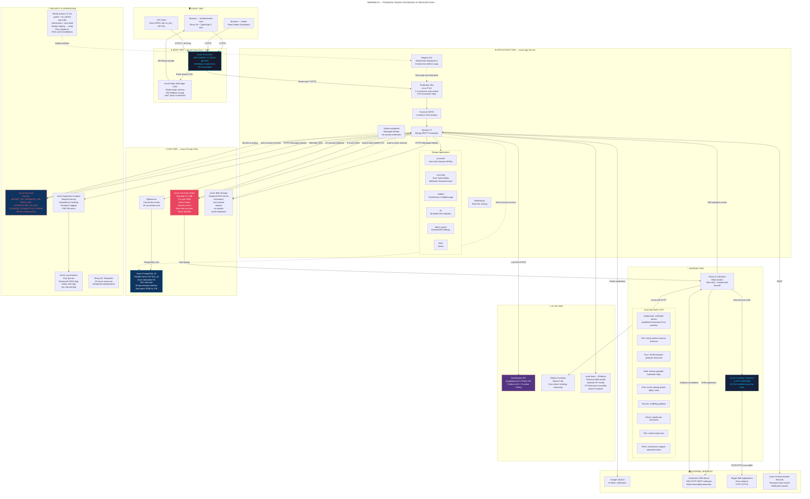

---

## Diagram 11A: Block Diagram — High-Level Subsystems

```mermaid
---
title: SafeWeb AI — System Block Diagram 11A: Layered Architecture
---
flowchart TB
    subgraph PRES["PRESENTATION LAYER"]
        direction LR
        P1["React SPA\nTypeScript + Vite\nTailwindCSS"]
        P2["Admin Dashboard\n7 admin routes"]
        P3["Public Pages\n17 public routes"]
        P4["ChatbotWidget\nFloating AI assistant"]
        P5["Azure Static Web Apps\nCDN global edge"]
    end

    subgraph GW["API GATEWAY LAYER"]
        direction LR
        GW1["Django REST Framework\nURL routing"]
        GW2["JWT Auth Middleware\nSimpleJWT"]
        GW3["Rate Limiting\n30/min anon 120/min auth"]
        GW4["CORS Whitelist\nAllowed origins"]
        GW5["Input Validation\nSerializer validation"]
        GW6["Gunicorn WSGI\n4 workers 120s"]
    end

    subgraph BIZ["BUSINESS LOGIC LAYER"]
        direction LR
        subgraph BIZ1["Scanning Engine"]
            BE1["ScanOrchestrator"]
            BE2["Recon Engine\n4 waves 50+ modules"]
            BE3["Vulnerability Testers\n85+ testers"]
            BE4["Nuclei Engine"]
            BE5["FP Reducer\n5-component ensemble"]
        end
        subgraph BIZ2["AI Chatbot"]
            BC1["ChatEngine"]
            BC2["OpenRouter LLM"]
            BC3["Local KB\n36+ topics"]
            BC4["Action Handlers\n7 tools"]
        end
        subgraph BIZ3["Admin Panel"]
            BA1["User Management"]
            BA2["ML Management"]
            BA3["System Settings"]
            BA4["Contact Management"]
        end
        subgraph BIZ4["Supporting"]
            BS1["Auth System\nJWT 2FA OAuth"]
            BS2["ML Pipeline\nPhishing Malware FP"]
            BS3["Learning Center\nArticle Library"]
            BS4["Scheduling\nCelery Beat"]
        end
    end

    subgraph INT["INTEGRATION LAYER"]
        direction LR
        I1["Celery 5.3\nAsync task queue"]
        I2["Tool Registry\n62 CLI wrappers\nHealth check"]
        I3["SSE Manager\nServer-Sent Events"]
        I4["OpenRouter\nGemini 2.0 Flash"]
        I5["Ollama\nLocal LLM"]
        I6["Interactsh\nOOB callbacks"]
        I7["Webhook Dispatcher\nHTTP retry delivery"]
        I8["Report Generator\nPDF SARIF CSV HTML"]
    end

    subgraph DAT["DATA LAYER"]
        direction LR
        D1["PostgreSQL 16\nPrimary datastore\n22 tables PgBouncer"]
        D2["Redis Cache\nCelery broker\nSessions tokens\nRate limit counters"]
        D3["Azure Blob Storage\nReports exports\nML models templates"]
        D4["Key Vault\nSecrets rotation\nManaged Identity"]
        D5["App Insights\nAPM tracing KQL\nAlerts"]
    end

    PRES -->|"REST API calls\nJWT Bearer\nHTTPS"| GW
    GW -->|"Authenticated\nrequests"| BIZ
    BIZ -->|"Async tasks\nSSE events\nExternal calls"| INT
    INT -->|"Reads/writes\nCache lookups\nFile storage"| DAT
    DAT -.->|"Config/secrets"| BIZ
    INT -.->|"SSE events"| PRES

    style BIZ1 fill:#1a1a2e,color:#00d4ff,stroke:#00d4ff
    style D1 fill:#0f3460,color:#fff,stroke:#00d4ff
    style D2 fill:#e94560,color:#fff,stroke:#ff6b6b
    style GW fill:#16213e,color:#fff,stroke:#0f3460
```

---

## Diagram 11B: Block Diagram — Scanning Engine Internal

```mermaid
---
title: SafeWeb AI — Block Diagram 11B: Scanning Engine Internal Architecture
---
flowchart TD
    subgraph ORCH["SCAN ORCHESTRATOR — Central Coordinator"]
        ORC_CTL["execute_scan() coordinator\nPhase sequencing SSE emission\nError handling cleanup"]
    end

    subgraph RECON_ENG["RECON ENGINE (4 Parallel Waves)"]
        W_A["Wave 0a — Network Layer\nDNS WHOIS cert transparency\nWAF detection CT logs\nSubdomain enum ports\nsubfinder amass dnsx nmap naabu"]
        W_B["Wave 0b — Response Layer\nTech fingerprint headers cookies\nCORS JS bundle analysis\nCMS cloud provider CMS screenshots\nwhatweb wappalyzer httpx eyewitness"]
        W_C["Wave 0c — Cross-Module OSINT\nEmail enumeration\nSubdomain takeover checks\nShodan Censys Wayback GitHub VirusTotal\nContent param API discovery\ngau waybackurls arjun paramspider"]
        W_D["Wave 0d — Analytics\nVuln correlator\nAttack surface mapping\nThreat intel aggregation\nRisk scoring scope analysis"]
    end

    subgraph AUTH_MGR["AUTH MANAGER"]
        AM1["Form Login Handler\nAuto-fill credential submission"]
        AM2["OAuth OIDC SAML Handler\nBearer token acquisition"]
        AM3["Headless SPA Auth\nPlaywright-based login"]
        AM4["JWT Analyzer\nAlgorithm claim validation"]
    end

    subgraph CRAWLER["WEB CRAWLER"]
        CR1["BFS Crawler\nkatana gospider hakrawler\nDepth-controlled traversal"]
        CR2["Playwright Renderer\nJS SPA rendering\nDynamic content extraction"]
        CR3["Form Interactor\nAuto-fill submission\nCAPTCHA detection (deep only)"]
        CR4["Scope Enforcer\nURL in-scope validation"]
    end

    subgraph ASM["ATTACK SURFACE MODELER"]
        ASM1["Entry Point Cataloger\nForms APIs endpoints params"]
        ASM2["Trust Boundary Mapper\nAuth levels data flows"]
        ASM3["Ollama LLM Strategist\nllama3.1:8b attack planning\nPrioritized attack paths"]
    end

    subgraph ANALYZERS["PARALLEL ANALYZERS (Phase 2-4)"]
        ANA_H["Security Header Analyzer\nCSP HSTS X-Frame-Options\nReferrer-Policy CORS headers"]
        ANA_S["SSL/TLS Analyzer\ntestssl sslyze tlsx\nCipher suites cert validity\nProtocol weaknesses"]
        ANA_C["Cookie Analyzer\nSecure HttpOnly SameSite\nSession fixation risks"]
    end

    subgraph TESTER_RUNNER["VULNERABILITY TESTER RUNNER (Phase 5)"]
        TR_PRIOR["ML Attack Prioritizer\nXGBoost page risk scoring"]
        TR_ASYNC["AsyncTaskRunner\nmax_concurrency=25\nBatched result saves"]
        TR_TESTERS["85+ Tester Instances\nSQLi XSS SSTI CMDI XXE CSRF\nSSRF Auth Misconfig CORS\nJWT OAuth SAML GraphQL\nWebSocket File Upload\nRace Condition IDOR\nMass Assignment Path Traversal\nBusiness Logic API\nClickjacking CRLF HPP\nHost Header HTTP Smuggling\nSSI Prototype Pollution\nOpen Redirect Cache Poison\nDNS Rebinding ReDoS\nXS-Leak XSLT Zip Slip\nDep Confusion 403 Bypass\nCMS WAF Evasion\nOWASP WSTG full coverage"]
    end

    subgraph NUCLEI_ENG["NUCLEI TEMPLATE ENGINE (Phase 5b)"]
        NE1["Template Manager\nBuiltin + custom templates\nAzure Blob source"]
        NE2["CLI Primary Runner\nnuclei binary execution\nTemplate directory scanning"]
        NE3["Python Fallback\nDirect template parsing\nHTTP execution"]
    end

    subgraph SECRET_SCAN["SECRET SCANNER (Phase 5c)"]
        SS1["Regex Engine\n200+ secret patterns\nAPI keys tokens passwords"]
        SS2["Entropy Analyzer\nHigh entropy string detection"]
        SS3["Git Dumper\nExposed .git directory\nCommit history scanning"]
    end

    subgraph INT_SCANNERS["INTEGRATED SCANNER RUNNER (Phase 5d)"]
        IS1["sqlmap / ghauri\nSQL injection deep dive"]
        IS2["dalfox\nXSS parameter scanning"]
        IS3["nikto\nWeb server misconfig"]
        IS4["testssl\nSSL/TLS deep analysis"]
        IS5["subjack\nSubdomain takeover"]
    end

    subgraph OOB_MGR["OOB MANAGER (Phase 5.1)"]
        OOB1["Interactsh Client\nOOB payload registration"]
        OOB2["Callback Poller\n2s interval polling"]
        OOB3["Correlation Engine\nPayload to finding mapping"]
    end

    subgraph VERIFIER["EVIDENCE VERIFIER (Phase 5.5)"]
        EV1["Request Replayer\nExact reproduction with auth"]
        EV2["Differential Analyzer\nBaseline vs payload comparison"]
        EV3["ML Classifier\n35pct weight FP scoring"]
    end

    subgraph EXPLOIT_GEN["EXPLOIT GENERATOR (Phase 5.7)"]
        EG1["PoC Code Generator\nLanguage-specific exploit code"]
        EG2["Bug Bounty Report Drafter\nTitle impact PoC steps remediation"]
        EG3["LLM Enhancement\nOllama context-aware refinement"]
    end

    subgraph CORRELATOR["ATTACK GRAPH + CORRELATOR (Phase 6-6.1)"]
        AG1["MITRE ATT-and-CK Mapper\nTactic technique assignment"]
        AG2["Mermaid Diagram Generator\nVisual attack flow diagrams"]
        AG3["Vuln Chain Detector\n10+ multi-step patterns\nSQLi+Auth XSS+CSRF etc"]
    end

    subgraph FP_REDUCER["FALSE POSITIVE REDUCER (Phase 6.5)"]
        FP1["FP Classifier 35pct\nML classification model"]
        FP2["Anomaly Detector 20pct\nIsolation forest"]
        FP3["Heuristic Rules 15pct\nContext-based logic"]
        FP4["Historical Patterns 10pct\nPast confirmed FP lookup"]
        FP5["LLM Reasoner 20pct\nGPT-based reasoning"]
        FP_ENS["Weighted Ensemble\nFinal is_false_positive decision"]
    end

    subgraph SCAN_MEMORY["SCAN MEMORY + LEARNING (Phase 7)"]
        SM1["ScanMemory\nStore successful techniques\nTarget fingerprint history"]
        SM2["KnowledgeUpdater\nUpdate KB with new findings\nRefine attack strategies"]
    end

    subgraph SCORE_CALC["SCORE CALCULATOR"]
        SC1["Deduction Engine\ncritical -25 high -15\nmedium -8 low -3 info -1"]
        SC2["Clamp to 0-100\nFinal security score"]
    end

    subgraph TOOL_REG["TOOL REGISTRY"]
        TR_REG["62 Tool Wrappers\nAbstract ExternalTool base"]
        TR_HEALTH["Health Check\nBinary availability test"]
        TR_DEGRADE["Graceful Degradation\nSkip unavailable tools"]
    end

    ORC_CTL --> W_A & W_B & W_C & W_D
    W_A & W_B & W_C & W_D --> AUTH_MGR
    AUTH_MGR --> CRAWLER
    CRAWLER --> ASM
    ASM --> ANALYZERS
    ANALYZERS --> TESTER_RUNNER
    TESTER_RUNNER --> OOB_MGR
    TESTER_RUNNER --> NUCLEI_ENG
    TESTER_RUNNER --> SECRET_SCAN
    TESTER_RUNNER --> INT_SCANNERS
    OOB_MGR & NUCLEI_ENG & SECRET_SCAN & INT_SCANNERS --> VERIFIER
    VERIFIER --> EXPLOIT_GEN
    EXPLOIT_GEN --> CORRELATOR
    CORRELATOR --> FP_REDUCER
    FP_REDUCER --> SCAN_MEMORY
    SCAN_MEMORY --> SCORE_CALC
    TOOL_REG -.->|"provides tools to"| RECON_ENG
    TOOL_REG -.->|"provides tools to"| TESTER_RUNNER
    TOOL_REG -.->|"provides tools to"| INT_SCANNERS
    TOOL_REG -.->|"provides tools to"| NUCLEI_ENG

    style TESTER_RUNNER fill:#1a1a2e,color:#00d4ff,stroke:#00d4ff,stroke-width:2px
    style ORC_CTL fill:#0f3460,color:#fff,stroke:#00d4ff,stroke-width:2px
    style FP_REDUCER fill:#16213e,color:#fff,stroke:#e94560
```

---

## Diagram 12: Relational Database Design ERD (Design Level)

```mermaid
---
title: SafeWeb AI — Relational DB Design (Design Level with Keys, Indexes, JSONB)
---
erDiagram
    USERS {
        uuid id PK "AUTO-GEN default=uuid4"
        varchar_255 email UK "NOT NULL INDEX"
        varchar_255 password "NOT NULL bcrypt hashed"
        varchar_255 name "NOT NULL"
        varchar_20 role "NOT NULL DEFAULT user CHECK IN user admin"
        varchar_255 avatar "NULLABLE"
        varchar_255 company "DEFAULT empty"
        varchar_255 job_title "DEFAULT empty"
        varchar_20 plan "NOT NULL DEFAULT free CHECK IN free pro enterprise"
        boolean is_2fa_enabled "NOT NULL DEFAULT false"
        varchar_64 two_fa_secret "NULLABLE"
        inet last_login_ip "NULLABLE"
        boolean is_superuser "DEFAULT false"
        boolean is_active "DEFAULT true"
        timestamptz created_at "NOT NULL DEFAULT now() INDEX"
        timestamptz updated_at "NOT NULL AUTO"
    }

    API_KEYS {
        varchar_64 id PK "format sk-live-{hex8}"
        uuid user_id FK "NOT NULL INDEX CASCADE"
        varchar_128 key UK "NOT NULL format sk-live-{hex24}"
        varchar_100 name "NOT NULL"
        boolean is_active "DEFAULT true"
        integer scans_count "DEFAULT 0"
        timestamptz last_used_at "NULLABLE"
        timestamptz created_at "NOT NULL DEFAULT now()"
    }

    USER_SESSIONS {
        uuid id PK
        uuid user_id FK "NOT NULL INDEX CASCADE"
        varchar_255 token_jti "BLANK INDEX"
        inet ip_address "NOT NULL"
        text user_agent "NOT NULL"
        boolean is_active "DEFAULT true"
        timestamptz last_activity "AUTO"
        timestamptz created_at "NOT NULL DEFAULT now()"
    }

    CONTACT_MESSAGES {
        uuid id PK
        varchar_255 name "NOT NULL"
        varchar_254 email "NOT NULL"
        varchar_30 subject "DEFAULT general"
        text message "NOT NULL"
        boolean is_read "DEFAULT false INDEX"
        text reply "BLANK"
        uuid replied_by_id FK "NULLABLE SET_NULL"
        timestamptz replied_at "NULLABLE"
        timestamptz created_at "NOT NULL DEFAULT now()"
    }

    JOB_APPLICATIONS {
        uuid id PK
        varchar_255 position "NOT NULL"
        varchar_255 name "NOT NULL"
        varchar_254 email "NOT NULL"
        varchar_30 phone "BLANK"
        text cover_letter "BLANK"
        varchar_500 resume_url "BLANK"
        varchar_500 portfolio_url "BLANK"
        varchar_20 status "DEFAULT pending INDEX"
        text admin_notes "BLANK"
        timestamptz created_at "NOT NULL DEFAULT now()"
    }

    SCANS {
        uuid id PK
        uuid user_id FK "NOT NULL INDEX CASCADE"
        uuid parent_scan_id FK "NULLABLE SET_NULL INDEX"
        varchar_20 scan_type "NOT NULL DEFAULT website"
        text target "NOT NULL"
        varchar_20 status "NOT NULL DEFAULT pending INDEX"
        varchar_20 depth "DEFAULT medium"
        varchar_20 scope_type "DEFAULT single_domain"
        boolean include_subdomains "DEFAULT true"
        jsonb seed_domains "DEFAULT array GIN_INDEX"
        jsonb discovered_domains "DEFAULT array"
        boolean check_ssl "DEFAULT true"
        boolean follow_redirects "DEFAULT true"
        integer score "DEFAULT 0 CHECK 0_TO_100"
        timestamptz started_at "NULLABLE"
        timestamptz completed_at "NULLABLE"
        integer duration "DEFAULT 0 seconds"
        text error_message "BLANK"
        varchar_500 uploaded_file "NULLABLE"
        jsonb recon_data "DEFAULT dict GIN_INDEX"
        integer progress "DEFAULT 0"
        varchar_64 current_phase "BLANK"
        varchar_150 current_tool "BLANK"
        jsonb phase_timings "DEFAULT dict"
        integer total_requests "DEFAULT 0"
        integer pages_crawled "DEFAULT 0"
        varchar_20 mode "DEFAULT standard"
        timestamptz next_scan_at "NULLABLE"
        jsonb tester_results "DEFAULT array"
        integer data_version "DEFAULT 0"
        timestamptz created_at "NOT NULL DEFAULT now() INDEX"
    }

    VULNERABILITIES {
        uuid id PK
        uuid scan_id FK "NOT NULL INDEX CASCADE"
        varchar_255 name "NOT NULL"
        varchar_20 severity "NOT NULL INDEX"
        varchar_100 category "NOT NULL INDEX"
        text description "NOT NULL"
        text impact "NOT NULL"
        text remediation "NOT NULL"
        varchar_64 cwe "BLANK"
        float8 cvss "DEFAULT 0.0 CHECK 0.0_TO_10.0"
        varchar_2048 affected_url "BLANK"
        varchar_100 tool_name "BLANK"
        text evidence "BLANK"
        boolean is_false_positive "DEFAULT false INDEX"
        boolean verified "DEFAULT false"
        float8 false_positive_score "DEFAULT 0.0"
        varchar_128 attack_chain "BLANK"
        varchar_255 oob_callback "BLANK"
        jsonb exploit_data "DEFAULT dict GIN_INDEX"
        timestamptz created_at "NOT NULL DEFAULT now()"
    }

    AUTH_CONFIGS {
        uuid id PK
        uuid scan_id FK "NOT NULL INDEX CASCADE"
        varchar_20 auth_type "NOT NULL"
        varchar_20 role "DEFAULT attacker"
        jsonb config_data "NOT NULL GIN_INDEX"
        timestamptz created_at "NOT NULL DEFAULT now()"
    }

    SCHEDULED_SCANS {
        uuid id PK
        uuid user_id FK "NOT NULL INDEX CASCADE"
        varchar_200 name "NOT NULL"
        jsonb scan_config "DEFAULT dict GIN_INDEX"
        varchar_20 schedule_preset "DEFAULT weekly"
        varchar_100 cron_expr "DEFAULT 0_2_star_star_1"
        timestamptz last_run "NULLABLE"
        timestamptz next_run "NOT NULL INDEX"
        boolean is_active "DEFAULT true INDEX"
        boolean notify_on_new_findings "DEFAULT true"
        boolean notify_on_ssl_expiry "DEFAULT true"
        boolean notify_on_asset_changes "DEFAULT true"
        timestamptz created_at "NOT NULL DEFAULT now()"
        timestamptz updated_at "NOT NULL AUTO"
    }

    ASSET_MONITOR_RECORDS {
        uuid id PK
        uuid scheduled_scan_id FK "NULLABLE INDEX CASCADE"
        varchar_2048 target "NOT NULL"
        varchar_50 change_type "NOT NULL INDEX"
        text detail "NOT NULL"
        varchar_20 severity "DEFAULT info"
        boolean acknowledged "DEFAULT false INDEX"
        timestamptz detected_at "NOT NULL DEFAULT now() INDEX"
    }

    SCAN_REPORTS {
        uuid id PK
        uuid scan_id FK "NOT NULL INDEX CASCADE"
        varchar_10 format "NOT NULL"
        varchar_500 file "NOT NULL"
        timestamptz generated_at "NOT NULL DEFAULT now()"
    }

    WEBHOOKS {
        uuid id PK
        uuid user_id FK "NOT NULL INDEX CASCADE"
        varchar_2048 url "NOT NULL"
        varchar_255 secret "BLANK"
        jsonb events "DEFAULT array"
        boolean is_active "DEFAULT true INDEX"
        integer max_retries "DEFAULT 3"
        timestamptz created_at "NOT NULL DEFAULT now()"
        timestamptz updated_at "NOT NULL AUTO"
    }

    WEBHOOK_DELIVERIES {
        uuid id PK
        uuid webhook_id FK "NOT NULL INDEX CASCADE"
        varchar_50 event_type "NOT NULL INDEX"
        jsonb payload "NOT NULL"
        varchar_20 status "DEFAULT pending INDEX"
        integer http_status "NULLABLE"
        text response_body "BLANK"
        integer attempt_count "DEFAULT 0"
        timestamptz last_attempted_at "NULLABLE"
        timestamptz delivered_at "NULLABLE"
        timestamptz created_at "NOT NULL DEFAULT now()"
    }

    NUCLEI_TEMPLATES {
        uuid id PK
        uuid uploaded_by_id FK "NULLABLE INDEX SET_NULL"
        varchar_255 name "NOT NULL"
        text description "BLANK"
        varchar_100 category "DEFAULT custom"
        varchar_20 severity "DEFAULT medium"
        text content "NOT NULL YAML"
        boolean is_active "DEFAULT true"
        timestamptz created_at "NOT NULL DEFAULT now()"
    }

    SCOPE_DEFINITIONS {
        uuid id PK
        uuid user_id FK "NOT NULL INDEX CASCADE"
        varchar_200 name "NOT NULL"
        text description "BLANK"
        varchar_200 organization "BLANK"
        jsonb in_scope "DEFAULT array GIN_INDEX"
        jsonb out_of_scope "DEFAULT array GIN_INDEX"
        varchar_20 import_format "DEFAULT manual"
        boolean is_active "DEFAULT true"
        timestamptz created_at "NOT NULL DEFAULT now()"
        timestamptz updated_at "NOT NULL AUTO"
    }

    MULTI_TARGET_SCANS {
        uuid id PK
        uuid user_id FK "NOT NULL INDEX CASCADE"
        uuid scope_id FK "NULLABLE INDEX SET_NULL"
        varchar_200 name "NOT NULL"
        jsonb targets "DEFAULT array GIN_INDEX"
        varchar_20 status "DEFAULT pending INDEX"
        varchar_20 scan_depth "DEFAULT medium"
        integer parallel_limit "DEFAULT 3"
        integer total_targets "DEFAULT 0"
        integer completed_targets "DEFAULT 0"
        integer failed_targets "DEFAULT 0"
        timestamptz created_at "NOT NULL DEFAULT now()"
        timestamptz completed_at "NULLABLE"
    }

    MULTI_TARGET_SCANS_SUB_SCANS {
        integer id PK "SERIAL auto-increment"
        uuid multitargetscan_id FK "NOT NULL INDEX"
        uuid scan_id FK "NOT NULL INDEX"
    }

    DISCOVERED_ASSETS {
        uuid id PK
        uuid user_id FK "NOT NULL INDEX CASCADE"
        uuid last_scan_id FK "NULLABLE INDEX SET_NULL"
        text url "NOT NULL"
        varchar_200 organization "BLANK"
        varchar_20 asset_type "DEFAULT web_app"
        jsonb tech_stack "DEFAULT array GIN_INDEX"
        boolean is_active "DEFAULT true"
        boolean is_new "DEFAULT true INDEX"
        timestamptz first_seen "NOT NULL DEFAULT now()"
        timestamptz last_seen "NOT NULL AUTO"
        text notes "BLANK"
    }

    CHATBOT_CHATSESSION {
        uuid id PK
        uuid user_id FK "NULLABLE INDEX CASCADE"
        uuid scan_id FK "NULLABLE INDEX SET_NULL"
        varchar_20 context_type "DEFAULT general"
        varchar_100 session_key "BLANK INDEX"
        varchar_200 title "DEFAULT New Chat"
        timestamptz created_at "NOT NULL DEFAULT now()"
        timestamptz updated_at "NOT NULL AUTO"
    }

    CHATBOT_CHATMESSAGE {
        uuid id PK
        uuid session_id FK "NOT NULL INDEX CASCADE"
        varchar_10 role "NOT NULL"
        text content "NOT NULL"
        integer tokens_used "DEFAULT 0"
        varchar_10 feedback "NULLABLE"
        jsonb action_data "NULLABLE GIN_INDEX"
        timestamptz created_at "NOT NULL DEFAULT now()"
    }

    ML_MLMODEL {
        uuid id PK
        varchar_200 name "NOT NULL"
        varchar_20 model_type "NOT NULL INDEX"
        varchar_20 version "DEFAULT 1.0.0"
        float8 accuracy "NULLABLE"
        float8 precision_score "NULLABLE"
        float8 recall "NULLABLE"
        float8 f1_score "NULLABLE"
        varchar_500 file_path "BLANK Azure Blob path"
        boolean is_active "DEFAULT false INDEX"
        integer training_samples "DEFAULT 0"
        float8 training_duration_seconds "NULLABLE"
        timestamptz trained_at "NULLABLE"
        timestamptz created_at "NOT NULL DEFAULT now()"
    }

    ML_MLPREDICTION {
        uuid id PK
        uuid model_id FK "NULLABLE INDEX SET_NULL"
        uuid scan_id FK "NULLABLE INDEX CASCADE"
        jsonb input_data "DEFAULT dict GIN_INDEX"
        varchar_50 prediction "NOT NULL"
        float8 confidence "NOT NULL"
        jsonb features "DEFAULT dict"
        timestamptz created_at "NOT NULL DEFAULT now()"
    }

    ADMIN_PANEL_SYSTEMALERT {
        uuid id PK
        varchar_200 title "NOT NULL"
        text message "NOT NULL"
        varchar_10 severity "DEFAULT info"
        boolean is_resolved "DEFAULT false INDEX"
        timestamptz created_at "NOT NULL DEFAULT now() INDEX"
        timestamptz resolved_at "NULLABLE"
    }

    ADMIN_PANEL_SYSTEMSETTINGS {
        varchar_100 key PK "UNIQUE NOT NULL"
        text value "DEFAULT empty"
        varchar_500 description "BLANK"
        timestamptz updated_at "NOT NULL AUTO"
    }

    LEARN_ARTICLE {
        uuid id PK
        varchar_300 title "NOT NULL"
        varchar_300 slug UK "NOT NULL INDEX"
        varchar_500 excerpt "NOT NULL"
        text content "NOT NULL"
        varchar_50 category "NOT NULL INDEX"
        varchar_100 author "DEFAULT Security Team"
        integer read_time "DEFAULT 5"
        varchar_2048 image "NULLABLE"
        boolean is_published "DEFAULT true INDEX"
        timestamptz created_at "NOT NULL DEFAULT now()"
        timestamptz updated_at "NOT NULL AUTO"
    }

    USERS ||--o{ API_KEYS : "user_id"
    USERS ||--o{ USER_SESSIONS : "user_id"
    USERS ||--o{ SCANS : "user_id"
    USERS ||--o{ SCHEDULED_SCANS : "user_id"
    USERS ||--o{ WEBHOOKS : "user_id"
    USERS ||--o{ SCOPE_DEFINITIONS : "user_id"
    USERS ||--o{ MULTI_TARGET_SCANS : "user_id"
    USERS ||--o{ DISCOVERED_ASSETS : "user_id"
    USERS ||--o{ CHATBOT_CHATSESSION : "user_id"
    USERS |o--o{ NUCLEI_TEMPLATES : "uploaded_by_id SET_NULL"
    USERS |o--o{ CONTACT_MESSAGES : "replied_by_id SET_NULL"
    SCANS ||--o{ VULNERABILITIES : "scan_id"
    SCANS ||--o{ AUTH_CONFIGS : "scan_id"
    SCANS ||--o{ SCAN_REPORTS : "scan_id"
    SCANS |o--o{ CHATBOT_CHATSESSION : "scan_id SET_NULL"
    SCANS |o--o{ ML_MLPREDICTION : "scan_id CASCADE"
    SCANS |o--o{ DISCOVERED_ASSETS : "last_scan_id SET_NULL"
    SCANS |o--o{ SCANS : "parent_scan_id self-ref"
    CHATBOT_CHATSESSION ||--o{ CHATBOT_CHATMESSAGE : "session_id"
    WEBHOOKS ||--o{ WEBHOOK_DELIVERIES : "webhook_id"
    SCHEDULED_SCANS ||--o{ ASSET_MONITOR_RECORDS : "scheduled_scan_id"
    ML_MLMODEL |o--o{ ML_MLPREDICTION : "model_id SET_NULL"
    SCOPE_DEFINITIONS |o--o{ MULTI_TARGET_SCANS : "scope_id SET_NULL"
    MULTI_TARGET_SCANS ||--o{ MULTI_TARGET_SCANS_SUB_SCANS : "multitargetscan_id"
    SCANS ||--o{ MULTI_TARGET_SCANS_SUB_SCANS : "scan_id M2M junction"
```

---

## Diagram 13: Class Diagram — Design Level with Patterns

```mermaid
---
title: SafeWeb AI — Class Diagram Design Level (Engine Layer + Design Patterns)
---
classDiagram
    namespace engine_core {
        class ScanOrchestrator {
            +UUID scan_id
            +Scan scan_obj
            +ToolRegistry tool_registry
            +execute_scan() void
            +_run_recon_async() dict
            +_setup_auth() dict
            +_crawl() List
            +_run_analyzers() dict
            +_model_attack_surface() dict
            +_run_testers(pages List) List
            +_poll_oob() List
            +_run_nuclei() List
            +_scan_secrets() List
            +_run_integrated_scanners() List
            +_verify_evidence(findings List) List
            +_generate_exploits(findings List) List
            +_build_attack_graph(findings List) dict
            +_chain_vulnerabilities(findings List) List
            +_reduce_false_positives(findings List) List
            +_update_scan_memory() void
            +_calculate_score() int
            +_emit_sse(event_type str, data dict) void
        }
        class AsyncTaskRunner {
            +int max_concurrency
            +int completed_count
            +int failed_count
            +List tasks
            +run_tasks(coroutines List) List
            +_worker(semaphore, coro) Any
        }
        class ToolRegistry {
            -dict _registry
            -ToolRegistry _instance
            +register(tool ExternalTool) void
            +discover() List
            +health_check() dict
            +get_tool(name str) ExternalTool
            +get_available_tools() List
            +getInstance() ToolRegistry$
        }
    }

    namespace tester_hierarchy {
        class BaseTester {
            +str name
            +str severity
            +str category
            +str cwe
            +test(page dict, session Session) List~Vulnerability~
            #_create_vulnerability(name, severity, url, evidence) Vulnerability
            #_send_payload(url, payload, method) Response
            #_check_response(response, pattern) bool
        }
        class SQLiTester {
            +str name
            +str severity
            +str category
            +str cwe
            +test(page, session) List
            -_test_error_based(url, params) List
            -_test_blind_time(url, params) List
            -_test_boolean(url, params) List
        }
        class XSSTester {
            +str name
            +str severity
            +str category
            +str cwe
            +test(page, session) List
            -_test_reflected(url, params) List
            -_test_stored(url, forms) List
            -_test_dom(url) List
        }
        class SSTITester {
            +str name
            +str severity
            +str category
            +str cwe
            +test(page, session) List
            -_detect_engine(url, params) str
        }
        class CmdInjTester {
            +str name
            +str severity
            +str category
            +str cwe
            +test(page, session) List
        }
        class SSRFTester {
            +str name
            +str severity
            +str category
            +str cwe
            +test(page, session) List
            -_test_oob_callback(url, params) List
        }
        class JWTTester {
            +str name
            +str severity
            +str category
            +str cwe
            +test(page, session) List
            -_test_alg_none(token) bool
            -_test_key_confusion(token) bool
        }
        class XXETester {
            +str name
            +str severity
            +str category
            +str cwe
            +test(page, session) List
        }
        class CSRFTester {
            +str name
            +str severity
            +str category
            +str cwe
            +test(page, session) List
        }
        class PromptInjectionTester {
            +str name
            +str severity
            +str category
            +str cwe
            +test(page, session) List
            -_detect_ai_endpoint(url) bool
        }
        class IDORTester {
            +str name
            +str severity
            +str category
            +str cwe
            +test(page, session) List
        }
        class GraphQLTester {
            +str name
            +str severity
            +str category
            +str cwe
            +test(page, session) List
            -_introspect(url) dict
        }
    }

    namespace tool_hierarchy {
        class ExternalTool {
            +str name
            +str binary_path
            +str version
            +run(args dict) dict
            +is_available() bool
            +get_version() str
        }
        class SubfinderWrapper {
            +str name
            +run(domain str) List~str~
        }
        class NmapWrapper {
            +str name
            +run(target str, ports str) dict
        }
        class NucleiWrapper {
            +str name
            +run(target str, templates List) List
        }
        class SqlmapWrapper {
            +str name
            +run(url str, params dict) List
        }
        class DalfoxWrapper {
            +str name
            +run(url str) List
        }
        class AmassWrapper {
            +str name
            +run(domain str) List~str~
        }
        class TrufflehogWrapper {
            +str name
            +run(target str) List
        }
    }

    namespace ai_layer {
        class ChatEngine {
            +str model_id
            +str openrouter_api_key
            +generate_response(message, session_id, scan_id) dict
            +_build_context(session_id, scan_id) dict
            +_call_llm(messages, tools) dict
            +_call_local_kb(message str) str
            +_execute_tool(tool_call dict) dict
            +_build_suggestions(context dict) List
        }
        class LocalKnowledgeBase {
            +List~dict~ entries
            +keyword_match(message str) str
            +_score_entry(entry, message) float
        }
        class AttackPrioritizer {
            +MLModel model
            +prioritize(pages List, recon_data dict) List
            +_extract_features(page dict) dict
        }
        class FalsePositiveReducer {
            +reduce(findings List) List
            +_score_fp(finding dict) float
            -_classify(finding) float
            -_anomaly_score(finding) float
            -_heuristic_score(finding) float
            -_historical_score(finding) float
            -_llm_score(finding) float
        }
        class NucleiEngine {
            +TemplateManager template_mgr
            +run(target str, templates List) List
            +_run_cli(target, template_dir) List
            +_run_python_fallback(target, templates) List
        }
    }

    namespace api_layer {
        class APIService {
            +scan(config dict) Scan
            +getScans(filters dict) List
            +getVulnerabilities(scan_id, filters) List
            +exportScan(scan_id, format) bytes
            +chat(message, session_id) dict
            +getDashboard() dict
            +getAdminDashboard() dict
        }
        class ScanStreamView {
            +stream(request, scan_id) StreamingHttpResponse
            +_get_events(scan_id, last_version) List
        }
        class WebCrawler {
            +int max_depth
            +List visited_urls
            +crawl(seed_urls List, depth str) List
            +_bfs_crawl(queue, session) List
            +_playwright_render(url str) str
            +_extract_forms(html str) List
            +_extract_links(html str) List
        }
    }

    BaseTester <|-- SQLiTester : inherits
    BaseTester <|-- XSSTester : inherits
    BaseTester <|-- SSTITester : inherits
    BaseTester <|-- CmdInjTester : inherits
    BaseTester <|-- SSRFTester : inherits
    BaseTester <|-- JWTTester : inherits
    BaseTester <|-- XXETester : inherits
    BaseTester <|-- CSRFTester : inherits
    BaseTester <|-- PromptInjectionTester : inherits
    BaseTester <|-- IDORTester : inherits
    BaseTester <|-- GraphQLTester : inherits

    ExternalTool <|-- SubfinderWrapper : inherits
    ExternalTool <|-- NmapWrapper : inherits
    ExternalTool <|-- NucleiWrapper : inherits
    ExternalTool <|-- SqlmapWrapper : inherits
    ExternalTool <|-- DalfoxWrapper : inherits
    ExternalTool <|-- AmassWrapper : inherits
    ExternalTool <|-- TrufflehogWrapper : inherits

    ToolRegistry "1" o-- "*" ExternalTool : Registry pattern registers
    ScanOrchestrator "1" *-- "1" ToolRegistry : uses
    ScanOrchestrator "1" *-- "1" AsyncTaskRunner : Pipeline pattern
    ScanOrchestrator "1" *-- "1" FalsePositiveReducer : uses
    ScanOrchestrator "1" *-- "1" AttackPrioritizer : uses
    ScanOrchestrator "1" *-- "1" NucleiEngine : uses
    ScanOrchestrator "1" *-- "1" WebCrawler : uses
    ScanOrchestrator "1" --> "*" BaseTester : Factory creates testers
    ScanOrchestrator "1" --> "1" ScanStreamView : Observer emits SSE events

    ChatEngine "1" *-- "1" LocalKnowledgeBase : fallback
    ChatEngine "1" --> "*" APIService : Command pattern tools

    APIService ..> ScanOrchestrator : Facade abstracts
    APIService ..> ChatEngine : Facade abstracts
```

---

## Legend

| Symbol | Meaning |
|--------|---------|
| `*--` | Composition (CASCADE delete) |
| `o--` | Aggregation (SET_NULL) |
| `<\|--` | Inheritance |
| `-->` | Association / Dependency |
| `..>` | Dependency (uses) |
| `-.->` | Extend/Include (use case) |
| `\|\|--o{` | ERD one-to-many |
| `\|o--o{` | ERD optional one-to-many |
| `PK` | Primary Key |
| `FK` | Foreign Key |
| `UK` | Unique Key |
| `GIN_INDEX` | PostgreSQL GIN index for JSONB |
| `CASCADE` | FK delete cascades |
| `SET_NULL` | FK sets null on parent delete |

> All diagrams reflect the **final Azure production deployment** of SafeWeb AI.
> Rendered with [Mermaid Live Editor](https://mermaid.live) — Mermaid v10+
