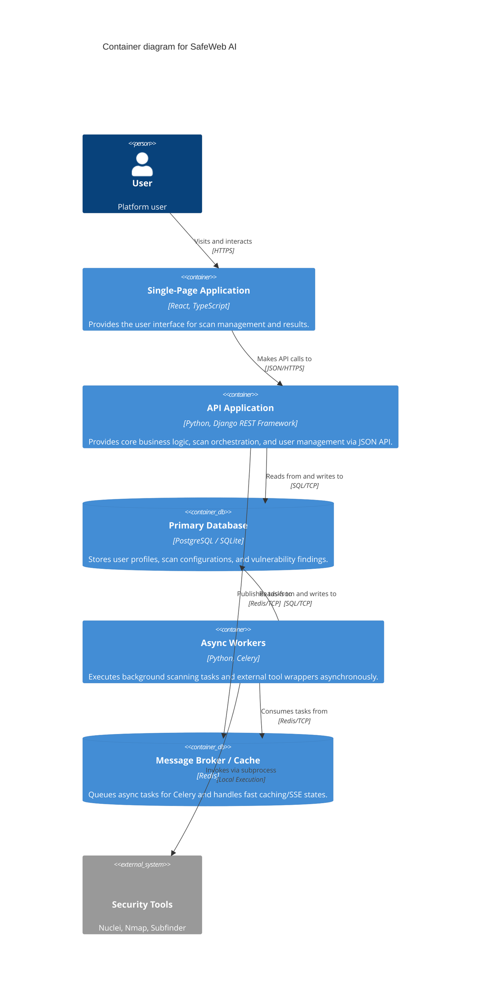

# Container Diagram

```mermaid
C4Container
    title Container diagram for SafeWeb AI

    Person(user, "User", "Platform user")

    Container(frontend, "Single-Page Application", "React, TypeScript", "Provides the user interface for scan management and results.")
    Container(api, "API Application", "Python, Django REST Framework", "Provides core business logic, scan orchestration, and user management via JSON API.")
    ContainerDb(db, "Primary Database", "PostgreSQL / SQLite", "Stores user profiles, scan configurations, and vulnerability findings.")
    Container(worker, "Async Workers", "Python, Celery", "Executes background scanning tasks and external tool wrappers asynchronously.")
    ContainerDb(redis, "Message Broker / Cache", "Redis", "Queues async tasks for Celery and handles fast caching/SSE states.")
    
    System_Ext(external_tools, "Security Tools", "Nuclei, Nmap, Subfinder", "Host binaries invoked by the worker for specialized scanning.")

    Rel(user, frontend, "Visits and interacts", "HTTPS")
    Rel(frontend, api, "Makes API calls to", "JSON/HTTPS")
    Rel(api, db, "Reads from and writes to", "SQL/TCP")
    Rel(api, redis, "Publishes tasks to", "Redis/TCP")
    Rel(worker, redis, "Consumes tasks from", "Redis/TCP")
    Rel(worker, db, "Reads from and writes to", "SQL/TCP")
    Rel(worker, external_tools, "Invokes via subprocess", "Local Execution")
```
