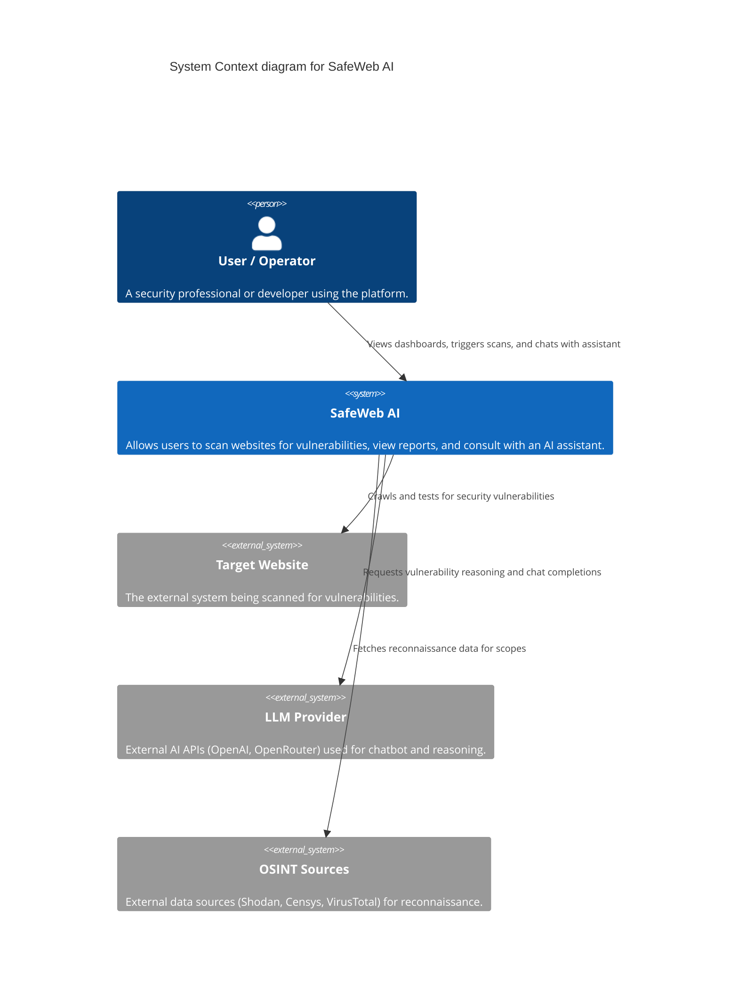

# System Context Diagram

```mermaid
C4Context
    title System Context diagram for SafeWeb AI

    Person(user, "User / Operator", "A security professional or developer using the platform.")
    
    System(safeweb, "SafeWeb AI", "Allows users to scan websites for vulnerabilities, view reports, and consult with an AI assistant.")
    
    System_Ext(target_site, "Target Website", "The external system being scanned for vulnerabilities.")
    System_Ext(llm_provider, "LLM Provider", "External AI APIs (OpenAI, OpenRouter) used for chatbot and reasoning.")
    System_Ext(osint_sources, "OSINT Sources", "External data sources (Shodan, Censys, VirusTotal) for reconnaissance.")
    
    Rel(user, safeweb, "Views dashboards, triggers scans, and chats with assistant")
    Rel(safeweb, target_site, "Crawls and tests for security vulnerabilities")
    Rel(safeweb, llm_provider, "Requests vulnerability reasoning and chat completions")
    Rel(safeweb, osint_sources, "Fetches reconnaissance data for scopes")
```
