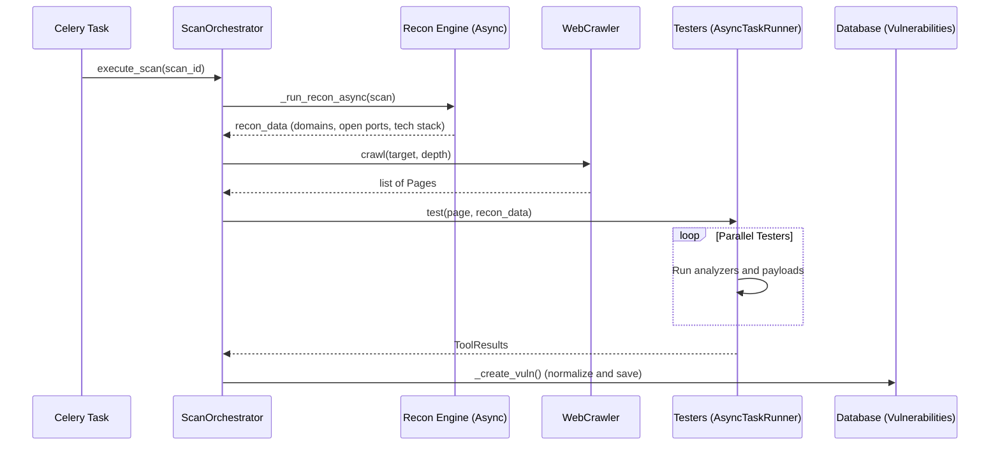

# Execution Flow Diagram

```mermaid
sequenceDiagram
    participant Celery as Celery Task
    participant Orch as ScanOrchestrator
    participant Recon as Recon Engine (Async)
    participant Crawler as WebCrawler
    participant Testers as Testers (AsyncTaskRunner)
    participant DB as Database (Vulnerabilities)

    Celery->>Orch: execute_scan(scan_id)
    Orch->>Recon: _run_recon_async(scan)
    Recon-->>Orch: recon_data (domains, open ports, tech stack)
    Orch->>Crawler: crawl(target, depth)
    Crawler-->>Orch: list of Pages
    Orch->>Testers: test(page, recon_data)
    loop Parallel Testers
        Testers->>Testers: Run analyzers and payloads
    end
    Testers-->>Orch: ToolResults
    Orch->>DB: _create_vuln() (normalize and save)
```
