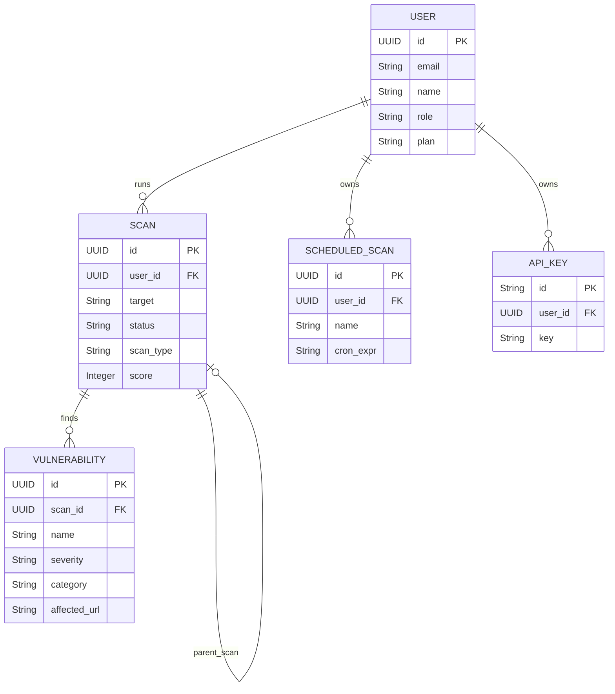

# Schema Map

```mermaid
erDiagram
    USER {
        UUID id PK
        String email
        String name
        String role
        String plan
    }
    SCAN {
        UUID id PK
        UUID user_id FK
        String target
        String status
        String scan_type
        Integer score
    }
    VULNERABILITY {
        UUID id PK
        UUID scan_id FK
        String name
        String severity
        String category
        String affected_url
    }
    SCHEDULED_SCAN {
        UUID id PK
        UUID user_id FK
        String name
        String cron_expr
    }
    API_KEY {
        String id PK
        UUID user_id FK
        String key
    }

    USER ||--o{ SCAN : "runs"
    USER ||--o{ SCHEDULED_SCAN : "owns"
    USER ||--o{ API_KEY : "owns"
    SCAN ||--o{ VULNERABILITY : "finds"
    SCAN ||--o| SCAN : "parent_scan"
```
